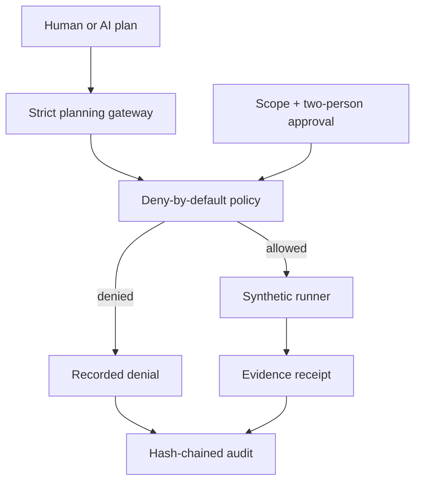

# FinRedOps

**Governance-first AI-assisted security testing orchestration for regulated financial institutions.**

[](https://github.com/bilgekayali/finredops/actions/workflows/ci.yml)
[](LICENSE)
[](pyproject.toml)
[](docs/SAFETY_BOUNDARY.md)

FinRedOps is an open-source control-plane prototype for teams that need to use
AI in security-testing workflows without letting a model decide what may run.
The model proposes typed actions; deterministic policy enforces scope, time,
separation of duties, immutable approvals, and a closed action catalog.

> [!IMPORTANT]
> Version 0.2 remains deliberately **simulation-only**. It has no exploit engine,
> target discovery, credential attacks, arbitrary shell, or network-capable
> test runner. The included dashboard uses reserved `.test` names and synthetic
> evidence. It is not a live penetration-testing engine, legal opinion,
> regulatory acceptance decision, independent audit, or compliance certificate.

## Why this project exists

In a highly regulated environment, “the AI decided to run it” is not an
acceptable authorization model. A defensible workflow needs explicit rules of
engagement, accountable people, constrained execution, reversible controls,
and evidence that can be independently reviewed. FinRedOps makes those
boundaries visible in code.



## Control model

| Boundary | v0.2 behavior |
|---|---|
| AI authority | May propose JSON only; cannot authorize or execute |
| Target scope | Exact hostname, IP, or CIDR allowlist; exclusions win |
| Action scope | Closed typed catalog; no free-form command field |
| Engagement approval | Business owner + control team; distinct people |
| Action approval | Control team + execution approver; distinct people |
| Approval integrity | Bound to SHA-256 digest and expiry time |
| Execution | Bundled synthetic fixtures only; no network calls |
| Institution preflight | Blocks unsafe scope breadth, production risk, contact, rate, and TTL settings |
| Evidence handling | Deterministically redacts likely secrets, e-mail, valid IBAN and payment-card identifiers |
| Persistence | Append-only SQLite snapshot revisions plus exact audit-prefix verification |
| Regulatory assurance | Source-linked BDDK, current SPK VII-128.10, KVKK and ISO/IEC control conclusions |
| Reporting | Annual bank, vendor source-code, vendor application and remediation templates |
| Kill switch | Control or execution approver can pause immediately |
| Accountability | Append-only hash chain with offline verification |

## Run the visual demo

Only Python 3.11+ is required; the package has no runtime dependencies.

```bash
python -m pip install -e .
python -m finredops demo --output demo-output
python -m finredops verify-audit demo-output/audit.jsonl
python -m finredops verify-store demo-output/finredops.db FRX-DEMO-2026-001
python -m finredops validate-report demo-output/regulatory-report.json
python -m finredops render-report demo-output/regulatory-report.json \
  --output demo-output/verified-report.md
python -m finredops serve --host 127.0.0.1 --port 8080
```

Open `http://127.0.0.1:8080`. The demo creates:

- a synthetic engagement with exact scope and one explicit exclusion;
- two digest-bound engagement approvals;
- four AI-style structured proposals and two approvals per proposal;
- three simulated evidence receipts and one intentional policy denial;
- a standalone operations dashboard and read-only local API;
- a JSON snapshot, hash-chained audit JSONL, and SQLite durable store;
- a Turkish regulatory crosswalk plus Markdown/JSON audit-support report.

Create a fillable report template for any supported assessment:

```bash
python -m finredops report-template \
  --type vendor_source_code_review \
  --output vendor-source-review.json
python -m finredops validate-engagement examples/synthetic_engagement.json
python -m finredops validate-plan examples/synthetic_ai_plan.json \
  --engagement examples/synthetic_engagement.json
```

Docker is optional:

```bash
docker build -t finredops .
docker run --rm -p 8080:8080 finredops
```

## Repository map

```text
src/finredops/
  planner.py      strict AI-to-control-plane boundary
  policy.py       deterministic, deny-by-default authorization
  catalog.py      closed catalog of typed actions
  runner.py       network-free synthetic evidence runner
  evidence.py     sensitive-data minimization boundary
  audit.py        append-only SHA-256 hash chain
  store.py        transactional SQLite revisions and audit persistence
  service.py      engagement and approval state machine
  profiles.py     financial-institution preflight policy
  regulations.py versioned Turkish regulatory control registry
  reporting.py   audit-support validation, crosswalk, and renderer
  api.py          loopback-first read-only API
  dashboard.py    self-contained operations interface
schemas/          versioned engagement, plan, and report JSON contracts
docs/             architecture, safety, reporting, and regulatory mapping
examples/         synthetic, reserved-namespace input documents
tests/            policy, integrity, boundary, and end-to-end tests
```

## Trust claims—and limits

FinRedOps demonstrates technical design patterns that can support governed
security testing. Hash chaining provides **tamper evidence**, not non-repudiation.
SQLite is durable demonstration storage, not an authenticated multi-tenant
system of record. A generated report is an **audit-support draft** until scoped,
tested, evidenced, independently reviewed, and signed by authorized humans.
Mappings do not establish legal applicability, certification, or compliance.
See [Türkiye regulatory profile](docs/TURKEY_REGULATORY_MAPPING.md),
[Reporting model](docs/REPORTING_MODEL.md), [Safety boundary](docs/SAFETY_BOUNDARY.md),
[Threat model](docs/THREAT_MODEL.md), and [Roadmap](docs/ROADMAP.md).

## Reference baseline

The design is informed by, but does not claim conformance with:

- [BDDK Bankaların Bilgi Sistemleri ve Elektronik Bankacılık Hizmetleri Hakkında Yönetmelik](https://www.resmigazete.gov.tr/eskiler/2020/03/20200315-10.htm)
- [BDDK Bilgi Sistemlerine İlişkin Sızma Testleri Hakkında Genelge 2012/1](https://www.bddk.org.tr/Mevzuat/DokumanGetir/915)
- [SPK Bilgi Sistemleri Yönetimine İlişkin Usul ve Esaslar Tebliği VII-128.10](https://www.resmigazete.gov.tr/eskiler/2025/03/20250313-8.htm)
- [KVKK 6698 sayılı Kanun Madde 12](https://www.kvkk.gov.tr/Icerik/2097/Kanun-doc) and [Personal Data Security Guide](https://www.kvkk.gov.tr/SharedFolderServer/CMSFiles/7512d0d4-f345-41cb-bc5b-8d5cf125e3a1.pdf)
- [ISO/IEC 27001:2022](https://www.iso.org/standard/27001) and [ISO/IEC 27002:2022](https://www.iso.org/standard/75652.html) (licensed text required for implementation)
- [NIST SP 800-115 — Technical Guide to Information Security Testing and Assessment](https://csrc.nist.gov/pubs/sp/800/115/final)
- [DORA, including Article 26 on threat-led penetration testing](https://eur-lex.europa.eu/legal-content/EN/TXT/HTML/?uri=CELEX%3A32022R2554)
- [Commission Delegated Regulation (EU) 2025/1190](https://eur-lex.europa.eu/eli/reg_del/2025/1190/oj/eng)
- [ECB TIBER-EU framework](https://www.ecb.europa.eu/paym/cyber-resilience/tiber-eu/html/index.en.html)
- [NIST AI RMF Generative AI Profile](https://www.nist.gov/publications/artificial-intelligence-risk-management-framework-generative-artificial-intelligence)
- [MITRE ATT&CK adversary emulation plans](https://attack.mitre.org/resources/adversary-emulation-plans/)

## Contributing

Start with [CONTRIBUTING.md](CONTRIBUTING.md). Contributions must preserve the
simulation-only boundary. Please report security issues through private
vulnerability reporting as described in [SECURITY.md](SECURITY.md).

Apache-2.0 licensed. Copyright 2026 Bilge Kayalı.
