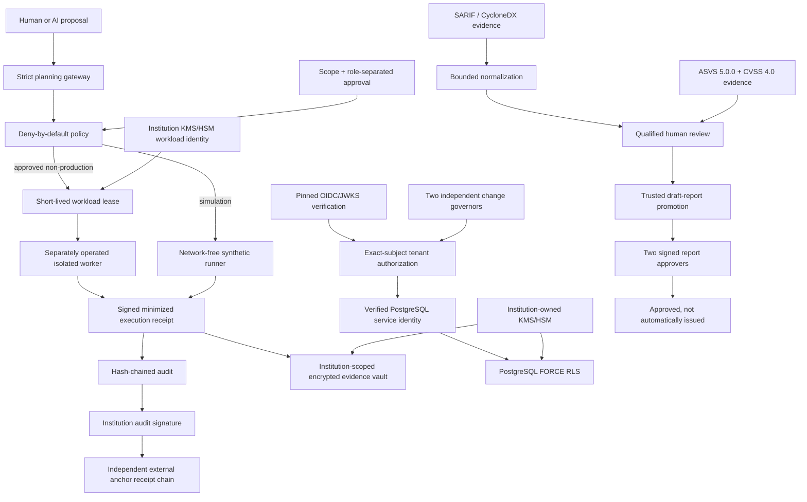

# FinRedOps

**Governance-first AI-assisted security testing orchestration for regulated financial institutions.**

[](https://github.com/bilgekayali/finredops/actions/workflows/ci.yml)
[](LICENSE)
[](pyproject.toml)
[](docs/SAFETY_BOUNDARY.md)

FinRedOps is an open-source security-governance control plane for teams that need
to use AI in security-testing workflows without allowing a model to decide what
may run. Models may propose typed actions; deterministic policy, cryptographic
identity and human-governance boundaries decide whether those actions may move
forward.

> [!IMPORTANT]
> **Version 1.0.0** is the first stable **production-reference** release. It
> preserves simulation as the safe default and the bounded non-production active
> validation boundary. v1 adds an explicit stable CLI/JSON compatibility contract,
> a machine-validated production-reference deployment profile, a supported
> v0.9.3→v1 upgrade path, release checksum/provenance evidence, CodeQL plus
> domain-specific security gates, and explicit legal/accessibility deployment
> responsibilities. It does **not** claim an external-human penetration test,
> certification, universal accessibility conformance, or permission for
> production active testing.

FinRedOps is **not** a general-purpose exploit framework, autonomous penetration
tester, legal opinion, regulatory acceptance decision, independent audit, or
compliance certificate.

## Summary

In regulated environments, “the AI decided to run it” is not an acceptable
authorization model. A defensible workflow requires explicit rules of engagement,
accountable people, constrained execution, evidence minimization, cryptographic
binding, tenant isolation, reversible operational controls and an audit trail that
can be independently reviewed.

FinRedOps v1 combines those boundaries into a stable reference architecture:



## v1 stable public contract

FinRedOps 1.x treats the **operator CLI and versioned JSON artifacts** as the
stable machine boundary. Internal Python modules remain implementation/reference
interfaces unless explicitly promoted later.

The machine-readable contract is `finredops.v1_release.v1_release_manifest()`.
It pins the stable operator commands, stable artifact discriminators and the
supported direct upgrade baseline (`0.9.3`). Within major version 1, a breaking
security or semantic change to a stable command/artifact requires a new major
version or a new coexisting artifact discriminator.

See **[v1 API and JSON-schema compatibility policy](docs/API_COMPATIBILITY.md)**.

## Production-reference deployment

The v1 reference architecture is represented by
`deploy/reference/production-reference.json` and validated against
`schemas/production-reference-deployment.schema.json` plus the stricter runtime
validator in `finredops.reference_deployment`.

The profile requires all of the following boundaries:

- pinned **OIDC/JWKS** identity verification with no verifier-side discovery;
- exact-subject authenticated tenant routing and closed capabilities;
- **PostgreSQL 17** runtime identity derived from `session_user` with `ENABLE` +
  `FORCE ROW LEVEL SECURITY`, no runtime superuser/`BYPASSRLS` path;
- institution cryptography through the built-in **AWS KMS** adapter with separate
  `data_encryption`, `audit_signing` and `workload_identity` key purposes;
- independently approved tenant-policy/service-account configuration changes;
- an external audit anchor under a separate trust/administrative domain;
- envelope-encrypted evidence lifecycle with append-only custody, forward-only
  retention and legal holds;
- a separately operated, signed, strict-egress, single-use-account,
  **non-production-only** isolated-worker contract.

The profile intentionally contains no password, token, private key, client
secret, API key or cloud credential. Production IAM, secret management, network
enforcement, KMS key policy, database administration, worker isolation, anchor
immutability and evidence storage remain deployment-owner responsibilities.

See **[Production reference deployment](docs/PRODUCTION_REFERENCE_DEPLOYMENT.md)**.

## Core control model

| Boundary | v1.0.0 behavior |
|---|---|
| AI authority | May propose typed JSON only; cannot authorize or execute |
| Target scope | Exact approved hostname/IP/CIDR; exclusions win |
| Action scope | Closed typed catalog; no free-form command field |
| Default execution | Simulation / network-free synthetic evidence |
| Built-in active validation | At most one controlled TLS `HEAD` request to an approved non-production target |
| Active exclusions | No redirects, response-body collection, discovery, crawling, port scanning, payload generation, embedded credentials, shell, or production active tests |
| Human approvals | Role-separated, digest-bound and time-bounded |
| External identity | Offline pinned OIDC ID-token + operator-supplied JWKS verification; no discovery/JWKS retrieval |
| Reviewer/business/report trust | Separate public-key trust roots and immutable object/signature bindings |
| Configuration changes | Exact state transition requires distinct `configuration_governor` + `security_governor` signatures |
| Tenant routing | Exact OIDC provider-config digest + subject grant + current policy/context digest + closed capabilities |
| PostgreSQL tenant source | Institution is derived from authenticated `session_user`, not a client-selected tenant GUC |
| Database RLS | `ENABLE ROW LEVEL SECURITY` + `FORCE ROW LEVEL SECURITY`; live catalog verification before use |
| Runtime DB account | Reader/writer separation; superuser, `BYPASSRLS`, owner or privileged `SET ROLE` path fails closed |
| Envelope encryption | Fresh per-record AES-256-GCM DEK wrapped by institution KMS/HSM provider |
| Key-backed evidence | Audit, execution and workload targets bind exact canonical digests to institution key references |
| External anchoring | Institution-signed audit state binds to an independently trusted signed receipt chain |
| Evidence vault | Institution-bound encrypted raw evidence, append-only custody, forward-only retention, history-derived legal holds and recovery bundles |
| SARIF | Bounded OASIS SARIF 2.1.0 normalization with mandatory qualified review |
| Supply-chain evidence | Bounded CycloneDX 1.7 normalization with source digest and human-review requirement |
| CVSS | FIRST CVSS 4.0 technical severity only; no automatic financial/business risk inference |
| ASVS | Digest-bound OWASP ASVS 5.0.0 requirement references with human-assessed coverage; no certification |
| Isolated worker | Short-lived institution workload identity + exact lease + one-time account + strict egress + emergency-stop verification |
| Worker enforcement claim | FinRedOps verifies contracts/receipts; kernel/VM/container/SDN enforcement remains external |
| Report promotion | Qualified evidence may become a draft only; risk/report approvals remain separate human decisions |
| Report issuance | Never automatically transmits, files or submits an approved report |
| Persistence compatibility | Governance SQLite schema v3; evidence-vault/anchor/grant-ledger schema v1; future versions fail closed |
| Upgrade | Supported direct pre-v1 baseline is 0.9.3; no destructive automatic downgrade |
| Release integrity | Clean-wheel smoke, SHA-256 manifest, version-tag binding and GitHub/Sigstore provenance |
| v1 security gate | CodeQL v4 `security-extended` plus domain-specific trust-boundary CI and regression suites |
| External-human audit | **Not claimed** by FinRedOps 1.0.0 |

## Regulatory & security assurance coverage

FinRedOps uses financial-sector and international standards as structured
analysis/control baselines. Framework names do not mean automatic applicability,
certification or regulatory acceptance.

| Framework / authority | How FinRedOps uses it |
|---|---|
| **BDDK** | Turkish banking regulatory crosswalk/applicability and penetration-testing assurance context |
| **SPK VII-128.10** | Capital-markets information-systems crosswalk/applicability |
| **KVKK 6698** | Personal-data security crosswalk, minimization and evidence-handling context |
| **TSE / TS 13638/T2** | Public penetration-testing prerequisites and licensed-clause evidence boundary |
| **ISO/IEC 27001:2022 & 27002:2022** | ISMS/control-oriented assurance mapping; no certification claim |
| **NIST SP 800-115** | Technical security-testing and assessment methodology baseline |
| **NIST SP 800-38D** | AES-GCM authenticated-encryption reference |
| **NIST SP 800-88 Rev.2** | Evidence/media disposition and sanitization governance reference; FinRedOps does not sanitize media |
| **NIST SP 800-207A** | Workload/service identity and zero-trust access-control reference |
| **OWASP ASVS 5.0.0** | Version-pinned requirement catalog/coverage evidence with human-assessed status |
| **CycloneDX 1.7** | Bounded SBOM/supply-chain component and vulnerability intake |
| **FIRST CVSS 4.0** | Vector-derived technical severity validation, separated from business impact |
| **GDPR — Regulation (EU) 2016/679** | Privacy/security/minimization analysis baseline; no clause-level compliance claim |
| **DORA — Regulation (EU) 2022/2554** | Financial-sector ICT risk, operational resilience and TLPT analysis baseline |
| **TIBER-EU** | Intelligence-led testing governance and human-accountability baseline |
| **NIST AI RMF** | AI-assisted workflow governance, traceability and human-oversight baseline |
| **MITRE ATT&CK** | Adversary-behavior and controlled-emulation planning reference |
| **OASIS SARIF 2.1.0** | Bounded machine-finding intake and canonical human-review queue |

The intended assurance chain is:

```text
security evidence
    -> bounded normalization
    -> qualified human disposition
    -> cryptographically verified identity / role binding
    -> authoritative review lifecycle resolution
    -> signed business risk acceptance when applicable
    -> technical + business impact
    -> regulatory / standard / requirement references
    -> human-confirmed applicability
    -> trusted draft assurance conclusion
    -> two signed human report approvals
```

This does **not** mean FinRedOps certifies compliance with BDDK, SPK, KVKK,
GDPR, DORA, TSE, ISO or ASVS. It provides structured analysis, traceability and
audit-support evidence while keeping legal applicability, regulatory acceptance,
certification and final approval with authorized humans.

See **[Regulatory and security assurance baseline](docs/ASSURANCE_BASELINE.md)**
and **[Assurance completeness](docs/ASSURANCE_COMPLETENESS.md)**.

## Operator quick start

Install locally:

```bash
python -m pip install -e .
```

Export and validate the packaged synthetic inputs:

```bash
finredops export-examples --output-dir finredops-examples
finredops validate-engagement finredops-examples/synthetic_engagement.json
finredops validate-plan finredops-examples/synthetic_ai_plan.json \
  --engagement finredops-examples/synthetic_engagement.json
```

Exercise the governed reviewed-report path without contacting a live target:

```bash
finredops demo-reviewed-report --output-dir demo-output/reviewed
finredops validate-report demo-output/reviewed/regulatory-report.json
```

Import scanner evidence explicitly:

```bash
finredops import-sarif examples/synthetic_sast.sarif.json \
  --output work/finding-intake.json
finredops validate-intake work/finding-intake.json
```

The repository also exposes the trust, approval, OIDC, change-control, tenant,
PostgreSQL, external-anchor and release-verification commands that form the v1
stable operator contract. See **[Operator Workflow](docs/OPERATOR_WORKFLOW.md)**
and **[API Compatibility](docs/API_COMPATIBILITY.md)**.

## Upgrade from v0.9.3

FinRedOps 1.0.0 supports a direct upgrade from the final v0.9.3 release baseline.
The upgrade requires a quiesced environment and verified pre-upgrade backups.
Historical institution key references and reviewer/approval/change/anchor trust
bundles required to verify existing artifacts must remain available.

FinRedOps does **not** implement destructive automatic downgrade. Do not manually
lower SQLite `user_version`, edit digests or remove custody/legal-hold state to
force an older binary to open newer data. If a transition cannot safely be
reversed, restore the verified pre-upgrade backup instead.

See **[Supported upgrade from v0.9.3 to v1](docs/UPGRADE_TO_V1.md)**,
**[Failure recovery](docs/FAILURE_RECOVERY.md)** and
**[Backup and restore](docs/BACKUP_RESTORE.md)**.

## Release integrity and provenance

A tagged release must use `vMAJOR.MINOR.PATCH` and match `pyproject.toml`. The
release workflow builds wheel + source distribution, installs the wheel in a
clean environment, checks the v1 stable CLI contract and packaged demo, emits a
machine-readable `v1-release-contract.json` and validated
`production-reference.json`, generates `CHECKSUMS.sha256`, and creates
GitHub/Sigstore artifact provenance.

Local byte-integrity verification:

```bash
finredops verify-release-checksums \
  --manifest CHECKSUMS.sha256 \
  --directory .
```

Build-origin verification is separate:

```bash
gh attestation verify finredops-1.0.0-py3-none-any.whl \
  --repo bilgekayali/finredops
```

Checksums do not prove build origin; provenance does not prove runtime
configuration correctness. See **[Release verification](docs/RELEASE_VERIFICATION.md)**
and **[Release integrity and provenance](docs/RELEASE_INTEGRITY.md)**.

## v1 security, legal and accessibility disposition

The repository-level v1 security gate combines GitHub CodeQL v4
`security-extended`, the full Python 3.11/3.12/3.13 test matrix, live PostgreSQL
17 RLS integration and the dedicated OIDC/change-control/tenant/anchor/vault/
assurance/workload/release-candidate boundaries.

**FinRedOps 1.0.0 does not claim that an external human security consultancy
performed a penetration test or certification.** A production institution should
commission its own independent review appropriate to its risk and regulatory
obligations.

Legal/regulatory applicability and deployed-UI accessibility acceptance are
explicit deployment-owner responsibilities. The repository does not provide a
legal opinion and does not claim universal WCAG conformance.

See **[v1 security review](docs/SECURITY_REVIEW_V1.md)** and
**[Legal/accessibility scope](docs/LEGAL_ACCESSIBILITY_SCOPE.md)**.

## Trust claims—and limits

v1 is a stability and production-reference milestone, not a relaxation of safety
constraints. In particular:

- hash chaining is tamper evidence, not non-repudiation by itself;
- SQLite remains local/reference persistence rather than the production
  multi-tenant database RLS boundary;
- an opaque KMS key reference does not prove correct IAM/key policy;
- the reference SQLite audit anchor is not physical WORM storage, a trusted
  timestamp authority or a Byzantine/public transparency log;
- the evidence-vault reference backend does not perform media sanitization;
- CVSS is technical severity, not financial/regulatory risk;
- ASVS/BDDK/SPK/KVKK/TSE/ISO/GDPR/DORA mappings do not certify compliance;
- FinRedOps does not prove VM/container/kernel isolation or firewall/SDN
  enforcement of an external worker;
- emergency stop cannot retroactively undo a request already transmitted;
- release provenance does not prove deployment configuration or absence of
  vulnerabilities;
- no version number itself establishes target authorization.

The complete list is **[FinRedOps 1.0.0 explicit non-claims](docs/V1_NON_CLAIMS.md)**.

## Repository map

```text
src/finredops/
  planner.py                 strict AI-to-control-plane proposal boundary
  policy.py                  deterministic deny-by-default authorization
  catalog.py                 closed typed action catalog
  runner.py                  network-free synthetic runner
  validation.py              optional bounded one-request non-production validation
  review.py / trust.py       qualified disposition, signed identity and lifecycle
  oidc_identity.py           offline pinned OIDC/JWKS verification
  tenant_auth.py             exact-subject tenant authorization
  postgres_rls.py            PostgreSQL RLS contract, live verifier and encrypted store
  change_control.py          two-governor signed configuration state transitions
  institution.py             institution key-reference/security context
  crypto_provider.py         provider-neutral KMS/HSM operations
  aws_kms.py                 built-in AWS KMS adapter
  envelope.py                per-record AES-256-GCM envelope encryption
  signed_evidence.py         institution-key-backed audit/receipt signatures
  anchor_*.py                external audit commitment/transport/offline verification
  evidence_vault.py          encrypted evidence lifecycle service
  vault_*.py                 custody, retention, legal hold, recovery and reference store
  supply_chain.py            bounded CycloneDX 1.7 intake
  cvss40.py                  FIRST CVSS 4.0 technical severity validation
  asvs_coverage.py           OWASP ASVS 5.0.0 digest-bound coverage
  workload_identity.py       short-lived institution workload identity
  workload_execution.py      exact lease, one-time account, egress and stop verification
  workload_ledger.py         versioned one-time grant-consumption ledger
  release_compatibility.py   final v0.9.3 persistence compatibility baseline
  v1_release.py              stable v1 public machine contract
  reference_deployment.py    strict secret-free v1 deployment-profile validator
  release_integrity.py       checksum verification and packaged examples

deploy/reference/             machine-readable v1 production-reference profile
schemas/                      strict versioned artifact and release contracts
docs/                         architecture, assurance, trust, operations and v1 release docs
tests/                        unit, boundary, integration, recovery and release-gate suites
```

## Reference baseline

The design is informed by, but does not claim conformance/certification with:

- [BDDK Bankaların Bilgi Sistemleri ve Elektronik Bankacılık Hizmetleri Hakkında Yönetmelik](https://www.resmigazete.gov.tr/eskiler/2020/03/20200315-10.htm)
- [BDDK Bilgi Sistemlerine İlişkin Sızma Testleri Hakkında Genelge 2012/1](https://www.bddk.org.tr/Mevzuat/DokumanGetir/915)
- [SPK Bilgi Sistemleri Yönetimine İlişkin Usul ve Esaslar Tebliği VII-128.10](https://www.resmigazete.gov.tr/eskiler/2025/03/20250313-8.htm)
- [KVKK 6698 Madde 12](https://www.kvkk.gov.tr/Icerik/2097/Kanun-doc) and [Personal Data Security Guide](https://www.kvkk.gov.tr/SharedFolderServer/CMSFiles/7512d0d4-f345-41cb-bc5b-8d5cf125e3a1.pdf)
- [TSE Bilişim Teknolojileri Sızma Testleri](https://www.tse.org.tr/sizma-testleri/) and [TS 13638/T2 firm certification prerequisites](https://www.tse.org.tr/sizma-testi-belgelendirmesi/)
- [ISO/IEC 27001:2022](https://www.iso.org/standard/27001) and [ISO/IEC 27002:2022](https://www.iso.org/standard/75652.html)
- [NIST SP 800-115 — Technical Guide to Information Security Testing and Assessment](https://csrc.nist.gov/pubs/sp/800/115/final)
- [NIST SP 800-38D — GCM authenticated encryption](https://csrc.nist.gov/pubs/sp/800/38/d/final)
- [NIST SP 800-88 Rev.2 — Guidelines for Media Sanitization](https://csrc.nist.gov/pubs/sp/800/88/r2/final)
- [NIST SP 800-207A — Zero Trust Architecture Model for Access Control in Cloud-Native Applications](https://csrc.nist.gov/pubs/sp/800/207/a/final)
- [NIST AI RMF Generative AI Profile](https://www.nist.gov/publications/artificial-intelligence-risk-management-framework-generative-artificial-intelligence)
- [OWASP Application Security Verification Standard](https://owasp.org/www-project/application-security-verification-standard/)
- [CycloneDX Specification 1.7](https://cyclonedx.org/docs/1.7/json/)
- [FIRST Common Vulnerability Scoring System v4.0](https://www.first.org/cvss/v4-0/)
- [SPIFFE Standards](https://spiffe.io/docs/latest/spiffe-about/spiffe-concepts/)
- [GDPR — Regulation (EU) 2016/679](https://eur-lex.europa.eu/eli/reg/2016/679/oj)
- [DORA — Regulation (EU) 2022/2554](https://eur-lex.europa.eu/eli/reg/2022/2554/oj)
- [Commission Delegated Regulation (EU) 2025/1190](https://eur-lex.europa.eu/eli/reg_del/2025/1190/oj/eng)
- [ECB TIBER-EU framework](https://www.ecb.europa.eu/paym/cyber-resilience/tiber-eu/html/index.en.html)
- [MITRE ATT&CK adversary emulation plans](https://attack.mitre.org/resources/adversary-emulation-plans/)
- [OASIS SARIF 2.1.0](https://docs.oasis-open.org/sarif/sarif/v2.1.0/os/sarif-v2.1.0-os.html)
- [OpenID Connect Core 1.0](https://openid.net/specs/openid-connect-core-1_0.html)
- [RFC 7517 — JSON Web Key](https://www.rfc-editor.org/rfc/rfc7517)
- [RFC 7519 — JSON Web Token](https://www.rfc-editor.org/rfc/rfc7519)
- [RFC 8725 — JWT Best Current Practices](https://www.rfc-editor.org/rfc/rfc8725)
- [PostgreSQL Row Security Policies](https://www.postgresql.org/docs/17/ddl-rowsecurity.html)
- [PostgreSQL Database Roles / role attributes](https://www.postgresql.org/docs/17/database-roles.html)
- [RFC 6962 — Certificate Transparency](https://www.rfc-editor.org/rfc/rfc6962)
- [Sigstore Rekor transparency log](https://docs.sigstore.dev/logging/overview/)

## Key documentation

- [v1 API and JSON-schema compatibility](docs/API_COMPATIBILITY.md)
- [Production reference deployment](docs/PRODUCTION_REFERENCE_DEPLOYMENT.md)
- [Supported upgrade to v1](docs/UPGRADE_TO_V1.md)
- [Release verification](docs/RELEASE_VERIFICATION.md)
- [v1 security review](docs/SECURITY_REVIEW_V1.md)
- [Legal/accessibility scope](docs/LEGAL_ACCESSIBILITY_SCOPE.md)
- [v1 explicit non-claims](docs/V1_NON_CLAIMS.md)
- [Regulatory and security assurance baseline](docs/ASSURANCE_BASELINE.md)
- [Assurance completeness](docs/ASSURANCE_COMPLETENESS.md)
- [Isolated workload execution](docs/WORKLOAD_EXECUTION.md)
- [OIDC / JWKS identity verification](docs/OIDC_IDENTITY.md)
- [Reviewer trust, identity binding and lifecycle](docs/TRUST_IDENTITY.md)
- [Signed business and report approvals](docs/SIGNED_APPROVALS.md)
- [Signed configuration change control](docs/CHANGE_CONTROL.md)
- [Tenant isolation and institution-owned key boundaries](docs/TENANT_ISOLATION.md)
- [PostgreSQL RLS and service-account boundary](docs/POSTGRES_RLS.md)
- [Institution-owned KMS/HSM envelope encryption](docs/KMS_ENVELOPE_SIGNING.md)
- [External audit anchoring](docs/AUDIT_ANCHORING.md)
- [Vault lifecycle](docs/VAULT_LIFECYCLE.md)
- [Failure recovery](docs/FAILURE_RECOVERY.md)
- [Backup and restore](docs/BACKUP_RESTORE.md)
- [Operations runbook](docs/OPERATIONS_RUNBOOK.md)
- [Threat model](docs/THREAT_MODEL.md)
- [Safety boundary](docs/SAFETY_BOUNDARY.md)
- [Roadmap](docs/ROADMAP.md)

## Contributing

Start with [CONTRIBUTING.md](CONTRIBUTING.md). Contributions must preserve the
closed catalog, safe-default execution model, human-approval boundaries and
controlled-validation limits. Security issues should be reported through the
private vulnerability-reporting process described in [SECURITY.md](SECURITY.md).

Apache-2.0 licensed. Copyright 2026 Bilge Kayalı.
