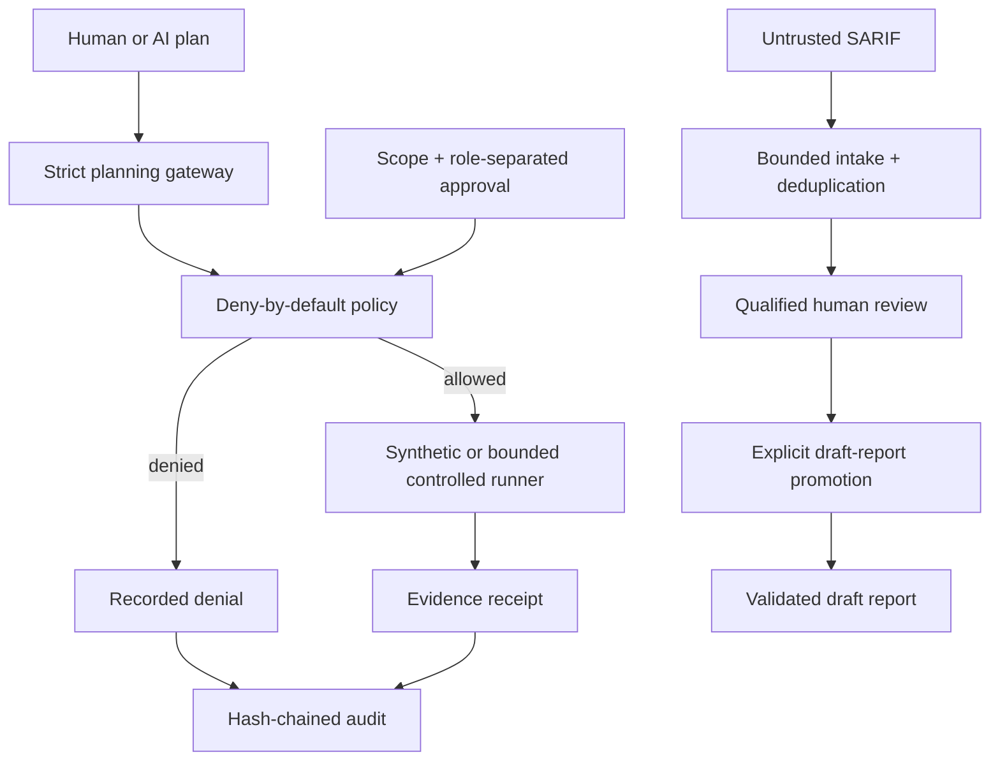

# FinRedOps

**Governance-first AI-assisted security testing orchestration for regulated financial institutions.**

[](https://github.com/bilgekayali/finredops/actions/workflows/ci.yml)
[](LICENSE)
[](pyproject.toml)
[](docs/SAFETY_BOUNDARY.md)

FinRedOps is an open-source control-plane prototype for teams that need to use
AI in security-testing workflows without allowing a model to decide what may
run. Models may propose typed actions; deterministic policy enforces scope,
time, separation of duties, immutable approvals, and a closed action catalog.

> [!IMPORTANT]
> **Version 0.6.0** keeps simulation as the safe default and preserves the
> bounded v0.4 active-validation boundary. It adds one end-to-end operator
> workflow across SARIF evidence intake, qualified finding review, explicit
> draft-report promotion, report validation, and reproducible synthetic output.
> Report issuance and human approval remain outside automation.

FinRedOps is **not** a general-purpose exploit framework, autonomous penetration
tester, legal opinion, regulatory acceptance decision, independent audit, or
compliance certificate.

## Example reviewed security report

The repository contains a readable synthetic output of the governed
**SARIF → qualified review → draft report** workflow:

**[Open the example security report](EXAMPLE_SECURITY_REPORT.md)**

The example contains no live-target data and remains a `draft`,
human-approval-required audit-support artifact.

## Why this project exists

In regulated environments, “the AI decided to run it” is not an acceptable
authorization model. A defensible workflow requires explicit rules of
engagement, accountable people, constrained execution, evidence minimization,
reversible controls, and an audit trail that can be independently reviewed.



## Core control model

| Boundary | v0.6 behavior |
|---|---|
| AI authority | May propose typed JSON only; cannot authorize or execute |
| Target scope | Exact hostname, IP, or CIDR allowlist; exclusions win |
| Action scope | Closed typed catalog; no free-form command field |
| Approvals | Role-separated, digest-bound, time-limited human decisions |
| Execution | Simulation by default; optional one-request TLS `HEAD` validation on approved non-production targets |
| Active boundary | No redirects, response-body collection, discovery, crawling, payloads, credentials, shell, or production active tests |
| Evidence handling | Deterministic minimization and redaction of likely sensitive identifiers |
| Machine findings | Bounded SARIF 2.1.0 intake with stable fingerprints and mandatory review |
| Finding disposition | Qualified-tester decision with evidence, final severity, impact, recommendation, and control mapping |
| Risk acceptance | Separate business risk owner with compensating controls and expiry |
| Draft promotion | Complete review set plus human-supplied asset, owner, and due date; never issues a report |
| Operator workflow | One CLI surface for legacy commands, report-spec templates, promotion, and synthetic demonstration |
| Reporting | Audit-support report templates and deterministic validation |
| Accountability | Append-only hash chain and offline-verifiable artifacts |

## v0.6 end-to-end operator workflow

Install the package in editable mode:

```bash
python -m pip install -e .
```

### 1. Import scanner evidence

```bash
finredops import-sarif examples/synthetic_sast.sarif.json \
  --output work/finding-intake.json
finredops validate-intake work/finding-intake.json
```

### 2. Review every candidate

```bash
finredops finding-review-template \
  --intake work/finding-intake.json \
  --finding-id FRX-SARIF-REPLACE-ME \
  --assessment-type vendor_source_code_review \
  --output work/review-draft.json

finredops finalize-finding-review \
  --intake work/finding-intake.json \
  --draft work/review-draft.json \
  --output work/review.json
```

Every candidate must receive one finalized human disposition before report
promotion can proceed.

### 3. Create the reviewed-report specification

```bash
finredops reviewed-report-spec-template \
  --intake work/finding-intake.json \
  --assessment-type vendor_source_code_review \
  --review work/review-1.json \
  --review work/review-2.json \
  --output work/reviewed-report-spec.json
```

The generated template is intentionally incomplete. The operator must replace
all `TODO` and date placeholders with accountable assessment metadata.
FinRedOps refuses to promote an unfinished template.

### 4. Promote reviewed findings into a draft report

```bash
finredops promote-reviewed-report \
  --intake work/finding-intake.json \
  --review work/review-1.json \
  --review work/review-2.json \
  --spec work/reviewed-report-spec.json \
  --output-dir work/reviewed-report
```

Optional finalized business risk acceptances may be supplied with repeated
`--acceptance` arguments.

The command produces:

```text
regulatory-report.json
regulatory-report.md
promotion-manifest.json
```

Existing operator outputs are not overwritten. The resulting report is always
`draft` and remains `ready_for_issue: false` until separate human report
approvals are provided.

### 5. Validate and render independently

```bash
finredops validate-report work/reviewed-report/regulatory-report.json
finredops render-report work/reviewed-report/regulatory-report.json \
  --output work/reviewed-report/verified-report.md
```

For the complete sequence, see
**[v0.6 Operator Workflow](docs/OPERATOR_WORKFLOW.md)**.

## Reproduce the reviewed-report demo

```bash
finredops demo-reviewed-report \
  --sarif examples/synthetic_sast.sarif.json \
  --output-dir demo-output/reviewed
```

This creates canonical intake, two finalized synthetic reviews, one promoted
finding, a draft JSON/Markdown report, and a promotion manifest. No live target
is contacted.

## Existing visual and assurance demo

```bash
python -m finredops demo --output demo-output
python -m finredops verify-audit demo-output/audit.jsonl
python -m finredops verify-store demo-output/finredops.db FRX-DEMO-2026-001
python -m finredops validate-report demo-output/regulatory-report.json
python -m finredops validate-applicability demo-output/applicability.json
python -m finredops validate-evidence-manifest demo-output/evidence-manifest.json
python -m finredops verify-bundle demo-output/audit-dossier.zip
python -m finredops render-report demo-output/regulatory-report.json \
  --output demo-output/verified-report.md
python -m finredops serve --host 127.0.0.1 --port 8080
```

The demo includes a synthetic engagement, digest-bound approvals, policy
decisions, evidence receipts, an intentional denial, an operations dashboard,
SQLite persistence, regulatory crosswalks, evidence custody, and an offline
review dossier.

## Repository map

```text
src/finredops/
  planner.py       strict AI-to-control-plane boundary
  policy.py        deterministic deny-by-default authorization
  catalog.py       closed catalog of typed actions
  runner.py        network-free synthetic evidence runner
  validation.py    optional bounded active validation
  intake.py        bounded SARIF parser and canonical candidates
  review.py        qualified disposition and role-separated risk acceptance
  promotion.py     explicit reviewed-finding to draft-report boundary
  operator_cli.py  v0.6 unified operator workflow and legacy delegation
  evidence.py      sensitive-data minimization boundary
  custody.py       metadata-only evidence registry and custody hash chain
  audit.py         append-only SHA-256 audit chain
  store.py         transactional SQLite revisions and audit persistence
  service.py       engagement and approval state machine
  profiles.py      financial-institution preflight policy
  regulations.py  versioned Turkish regulatory control registry
  applicability.py human-confirmed regulatory/standards scope
  reporting.py     audit-support validation, crosswalk, and renderer
  diffing.py       report revision and remediation delta
  bundle.py        deterministic audit dossier builder and verifier
  api.py           loopback-first read-only API
  dashboard.py     self-contained operations interface
schemas/           versioned data contracts
docs/              architecture, safety, assurance, and operator workflow
examples/          synthetic reserved-namespace inputs
tests/             policy, integrity, boundary, and end-to-end tests
```

## Trust claims—and limits

FinRedOps demonstrates technical patterns that can support governed security
testing. Hash chaining provides **tamper evidence**, not non-repudiation.
SQLite is durable demonstration storage, not an authenticated multi-tenant
system of record. Regulatory mappings do not establish legal applicability,
certification, or compliance. A generated report remains an audit-support draft
until it has been scoped, tested, evidenced, independently reviewed, and signed
by authorized humans.

Key documentation:

- [Safety boundary](docs/SAFETY_BOUNDARY.md)
- [Threat model](docs/THREAT_MODEL.md)
- [Controlled validation](docs/CONTROLLED_VALIDATION.md)
- [Machine finding intake](docs/EVIDENCE_INTAKE.md)
- [Qualified finding review](docs/FINDING_REVIEW.md)
- [Reviewed report promotion](docs/REVIEWED_REPORT_PROMOTION.md)
- [v0.6 Operator Workflow](docs/OPERATOR_WORKFLOW.md)
- [Reporting model](docs/REPORTING_MODEL.md)
- [Türkiye regulatory mapping](docs/TURKEY_REGULATORY_MAPPING.md)
- [Applicability](docs/APPLICABILITY.md)
- [Chain of custody](docs/CHAIN_OF_CUSTODY.md)
- [Audit dossier](docs/AUDIT_DOSSIER.md)
- [Roadmap](docs/ROADMAP.md)

## Contributing

Start with [CONTRIBUTING.md](CONTRIBUTING.md). Contributions must preserve the
closed catalog, safe-default execution model, human-approval boundaries, and
controlled-validation limits. Security issues should be reported through the
private vulnerability-reporting process described in [SECURITY.md](SECURITY.md).

Apache-2.0 licensed. Copyright 2026 Bilge Kayalı.
