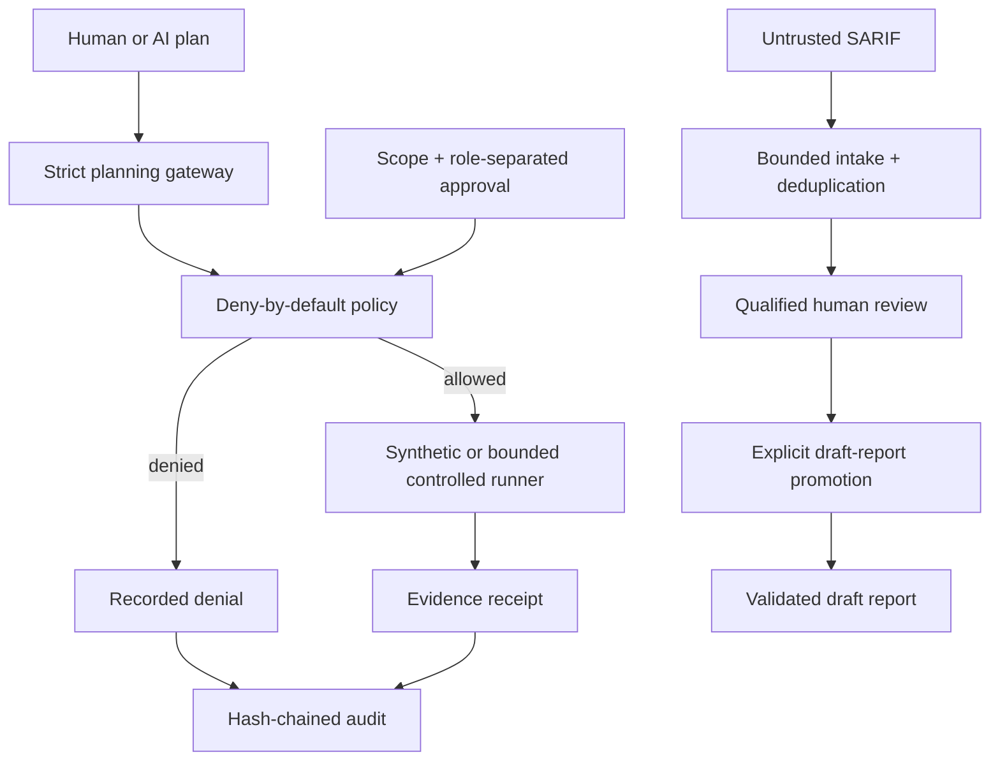

# FinRedOps

**Governance-first AI-assisted security testing orchestration for regulated financial institutions.**

[](https://github.com/bilgekayali/finredops/actions/workflows/ci.yml)
[](LICENSE)
[](pyproject.toml)
[](docs/SAFETY_BOUNDARY.md)

FinRedOps is an open-source control-plane prototype for teams that need to use
AI in security-testing workflows without allowing a model to decide what may
run. Models may propose typed actions; deterministic policy enforces scope,
time, separation of duties, immutable approvals, and a closed action catalog.

> [!IMPORTANT]
> **Version 0.6.1** keeps simulation as the safe default and preserves the
> bounded v0.4 active-validation boundary. It adds release-integrity controls
> around the v0.6 end-to-end operator workflow: packaged synthetic examples,
> clean-wheel smoke testing, SHA-256 release verification, version-tag binding,
> and GitHub/Sigstore build provenance. Report issuance and human approval
> remain outside automation.

FinRedOps is **not** a general-purpose exploit framework, autonomous penetration
tester, legal opinion, regulatory acceptance decision, independent audit, or
compliance certificate.

## Example reviewed security report

The repository contains a readable synthetic output of the governed
**SARIF → qualified review → draft report** workflow:

**[Open the example security report](EXAMPLE_SECURITY_REPORT.md)**

The example contains no live-target data and remains a `draft`,
human-approval-required audit-support artifact.

## Why this project exists

In regulated environments, “the AI decided to run it” is not an acceptable
authorization model. A defensible workflow requires explicit rules of
engagement, accountable people, constrained execution, evidence minimization,
reversible controls, and an audit trail that can be independently reviewed.



## Regulatory & security assurance coverage

FinRedOps analyzes security evidence and draft assurance conclusions against a
combination of **implemented financial-sector regulatory/control mappings** and
**international security-testing, privacy, operational-resilience and AI-risk
baselines**. Framework names are not decorative report labels: where structured
support exists, findings can be linked to control identifiers, applicability,
evidence and human-reviewed conclusions.

| Framework / authority | How FinRedOps uses it today |
|---|---|
| **BDDK** | Implemented Turkish banking regulatory crosswalk/applicability and penetration-testing assurance context |
| **SPK VII-128.10** | Implemented capital-markets information-systems crosswalk/applicability |
| **KVKK 6698** | Implemented personal-data security crosswalk/applicability and evidence-minimization context |
| **TSE / TS 13638/T2** | Public penetration-testing prerequisites and licensed-clause evidence boundary |
| **ISO/IEC 27001:2022 & 27002:2022** | ISMS/control applicability and control-oriented assurance mapping; no certification claim |
| **NIST SP 800-115** | Technical security-testing and assessment methodology baseline |
| **OWASP ASVS 5.0** | Application-security verification baseline and finding/control tagging; deeper versioned requirement coverage is on the roadmap |
| **GDPR — Regulation (EU) 2016/679** | EU privacy/security, minimization and evidence-handling analysis baseline; no clause-level compliance claim |
| **DORA — Regulation (EU) 2022/2554** | Financial-sector ICT risk, operational-resilience and TLPT analysis baseline |
| **TIBER-EU** | Intelligence-led testing governance and human-accountability baseline |
| **NIST AI RMF** | AI-assisted workflow governance, traceability and human-oversight baseline |
| **MITRE ATT&CK** | Adversary-behavior and controlled-emulation planning reference |
| **OASIS SARIF 2.1.0** | Implemented bounded machine-finding intake and canonical review queue |

The intended assurance chain is:

```text
security evidence
    -> bounded normalization
    -> qualified human disposition
    -> technical + business impact
    -> regulatory / standard / requirement references
    -> human-confirmed applicability
    -> draft assurance conclusion
    -> independent human approval
```

This does **not** mean FinRedOps certifies compliance with BDDK, SPK, KVKK,
GDPR, DORA, TSE or ISO requirements. It provides structured analysis,
traceability and audit-support evidence while keeping legal applicability,
regulatory acceptance, certification and final approval with authorized humans.

See **[Regulatory and security assurance baseline](docs/ASSURANCE_BASELINE.md)**
for the detailed coverage matrix, implementation status and official reference
sources.

## Core control model

| Boundary | v0.6.1 behavior |
|---|---|
| AI authority | May propose typed JSON only; cannot authorize or execute |
| Target scope | Exact hostname, IP, or CIDR allowlist; exclusions win |
| Action scope | Closed typed catalog; no free-form command field |
| Approvals | Role-separated, digest-bound, time-limited human decisions |
| Execution | Simulation by default; optional one-request TLS `HEAD` validation on approved non-production targets |
| Active boundary | No redirects, response-body collection, discovery, crawling, payloads, credentials, shell, or production active tests |
| Evidence handling | Deterministic minimization and redaction of likely sensitive identifiers |
| Machine findings | Bounded SARIF 2.1.0 intake with stable fingerprints and mandatory review |
| Finding disposition | Qualified-tester decision with evidence, final severity, impact, recommendation, and control mapping |
| Risk acceptance | Separate business risk owner with compensating controls and expiry |
| Regulatory assurance | BDDK, SPK, KVKK, TSE and ISO applicability/crosswalk support plus international analysis baselines |
| Draft promotion | Complete review set plus human-supplied asset, owner, and due date; never issues a report |
| Operator workflow | One CLI surface for legacy commands, report-spec templates, promotion, and synthetic demonstration |
| Release integrity | Wheel/sdist checksums, packaged examples, clean-wheel smoke test, version-tag binding, GitHub/Sigstore provenance |
| Reporting | Audit-support report templates and deterministic validation |
| Accountability | Append-only hash chain and offline-verifiable artifacts |

## v0.6 end-to-end operator workflow

Install the package in editable mode:

```bash
python -m pip install -e .
```

### 1. Import scanner evidence

```bash
finredops import-sarif examples/synthetic_sast.sarif.json \
  --output work/finding-intake.json
finredops validate-intake work/finding-intake.json
```

### 2. Review every candidate

```bash
finredops finding-review-template \
  --intake work/finding-intake.json \
  --finding-id FRX-SARIF-REPLACE-ME \
  --assessment-type vendor_source_code_review \
  --output work/review-draft.json

finredops finalize-finding-review \
  --intake work/finding-intake.json \
  --draft work/review-draft.json \
  --output work/review.json
```

Every candidate must receive one finalized human disposition before report
promotion can proceed.

### 3. Create the reviewed-report specification

```bash
finredops reviewed-report-spec-template \
  --intake work/finding-intake.json \
  --assessment-type vendor_source_code_review \
  --review work/review-1.json \
  --review work/review-2.json \
  --output work/reviewed-report-spec.json
```

The generated template is intentionally incomplete. The operator must replace
all `TODO` and date placeholders with accountable assessment metadata.
FinRedOps refuses to promote an unfinished template.

### 4. Promote reviewed findings into a draft report

```bash
finredops promote-reviewed-report \
  --intake work/finding-intake.json \
  --review work/review-1.json \
  --review work/review-2.json \
  --spec work/reviewed-report-spec.json \
  --output-dir work/reviewed-report
```

Optional finalized business risk acceptances may be supplied with repeated
`--acceptance` arguments.

The command produces:

```text
regulatory-report.json
regulatory-report.md
promotion-manifest.json
```

Existing operator outputs are not overwritten. The resulting report is always
`draft` and remains `ready_for_issue: false` until separate human report
approvals are provided.

### 5. Validate and render independently

```bash
finredops validate-report work/reviewed-report/regulatory-report.json
finredops render-report work/reviewed-report/regulatory-report.json \
  --output work/reviewed-report/verified-report.md
```

For the complete sequence, see
**[v0.6 Operator Workflow](docs/OPERATOR_WORKFLOW.md)**.

## Reproduce the reviewed-report demo from an installed wheel

v0.6.1 ships the synthetic engagement, plan, and SARIF input as package data.
A source checkout is no longer required for the reviewed-report demo:

```bash
finredops export-examples --output-dir finredops-examples
finredops demo-reviewed-report --output-dir demo-output/reviewed
finredops validate-report demo-output/reviewed/regulatory-report.json
```

`demo-reviewed-report` uses the packaged synthetic SARIF by default. An explicit
SARIF file may still be supplied with `--sarif`.

The demo creates canonical intake, two finalized synthetic reviews, one promoted
finding, a draft JSON/Markdown report, and a promotion manifest. No live target
is contacted.

## v0.6.1 release integrity and provenance

Tagged releases build a wheel and source distribution, smoke-test the installed
wheel in a clean environment, generate a `CHECKSUMS.sha256` manifest, and create
GitHub/Sigstore artifact provenance.

Local checksum verification:

```bash
finredops verify-release-checksums \
  --manifest ./CHECKSUMS.sha256 \
  --directory .
```

This verifies local SHA-256 integrity only. It deliberately does **not** claim
that provenance has been verified.

Verify the build origin separately with GitHub CLI artifact attestations:

```bash
gh attestation verify finredops-0.6.1-py3-none-any.whl \
  --repo bilgekayali/finredops
```

See **[Release integrity and provenance](docs/RELEASE_INTEGRITY.md)** for the
trust model, tag/version binding, clean-wheel test, and verification boundaries.

## Existing visual and assurance demo

```bash
python -m finredops demo --output demo-output
python -m finredops verify-audit demo-output/audit.jsonl
python -m finredops verify-store demo-output/finredops.db FRX-DEMO-2026-001
python -m finredops validate-report demo-output/regulatory-report.json
python -m finredops validate-applicability demo-output/applicability.json
python -m finredops validate-evidence-manifest demo-output/evidence-manifest.json
python -m finredops verify-bundle demo-output/audit-dossier.zip
python -m finredops render-report demo-output/regulatory-report.json \
  --output demo-output/verified-report.md
python -m finredops serve --host 127.0.0.1 --port 8080
```

The demo includes a synthetic engagement, digest-bound approvals, policy
decisions, evidence receipts, an intentional denial, an operations dashboard,
SQLite persistence, a BDDK/SPK/KVKK/TSE/ISO regulatory crosswalk, international
security/resilience analysis baselines, evidence custody, and an offline review
dossier.

## Repository map

```text
src/finredops/
  planner.py           strict AI-to-control-plane boundary
  policy.py            deterministic deny-by-default authorization
  catalog.py           closed catalog of typed actions
  runner.py            network-free synthetic evidence runner
  validation.py        optional bounded active validation
  intake.py            bounded SARIF parser and canonical candidates
  review.py            qualified disposition and role-separated risk acceptance
  promotion.py         explicit reviewed-finding to draft-report boundary
  operator_cli.py      unified operator workflow and release-integrity commands
  release_integrity.py packaged examples and strict local checksum verification
  examples/            installed-wheel synthetic engagement, plan, and SARIF
  evidence.py          sensitive-data minimization boundary
  custody.py           metadata-only evidence registry and custody hash chain
  audit.py             append-only SHA-256 audit chain
  store.py             transactional SQLite revisions and audit persistence
  service.py           engagement and approval state machine
  profiles.py          financial-institution preflight policy
  regulations.py      versioned Turkish regulatory control registry
  applicability.py     human-confirmed regulatory/standards scope
  reporting.py         audit-support validation, crosswalk, and renderer
  diffing.py           report revision and remediation delta
  bundle.py            deterministic audit dossier builder and verifier
  api.py               loopback-first read-only API
  dashboard.py         self-contained operations interface
schemas/               versioned data contracts
docs/                  architecture, safety, assurance, operator, and release workflow
examples/              source-tree synthetic reserved-namespace inputs
tests/                 policy, integrity, boundary, packaging, and end-to-end tests
```

## Trust claims—and limits

FinRedOps demonstrates technical patterns that can support governed security
testing. Hash chaining provides **tamper evidence**, not non-repudiation.
SQLite is durable demonstration storage, not an authenticated multi-tenant
system of record. Regulatory mappings do not establish legal applicability,
certification, or compliance. A generated report remains an audit-support draft
until it has been scoped, tested, evidenced, independently reviewed, and signed
by authorized humans.

Release checksum validation establishes local byte integrity relative to the
supplied manifest; it does not establish build origin. GitHub/Sigstore artifact
attestations address build provenance only when the consumer verifies them.
Neither mechanism authenticates reviewers or report approvers.

## Reference baseline

The design and analysis model are informed by, but do not claim conformance with:

- [BDDK Bankaların Bilgi Sistemleri ve Elektronik Bankacılık Hizmetleri Hakkında Yönetmelik](https://www.resmigazete.gov.tr/eskiler/2020/03/20200315-10.htm)
- [BDDK Bilgi Sistemlerine İlişkin Sızma Testleri Hakkında Genelge 2012/1](https://www.bddk.org.tr/Mevzuat/DokumanGetir/915)
- [SPK Bilgi Sistemleri Yönetimine İlişkin Usul ve Esaslar Tebliği VII-128.10](https://www.resmigazete.gov.tr/eskiler/2025/03/20250313-8.htm)
- [KVKK 6698 sayılı Kanun Madde 12](https://www.kvkk.gov.tr/Icerik/2097/Kanun-doc) and [Personal Data Security Guide](https://www.kvkk.gov.tr/SharedFolderServer/CMSFiles/7512d0d4-f345-41cb-bc5b-8d5cf125e3a1.pdf)
- [TSE Bilişim Teknolojileri Sızma Testleri](https://www.tse.org.tr/sizma-testleri/) and [TS 13638/T2 firm certification prerequisites](https://www.tse.org.tr/sizma-testi-belgelendirmesi/)
- [ISO/IEC 27001:2022](https://www.iso.org/standard/27001) and [ISO/IEC 27002:2022](https://www.iso.org/standard/75652.html)
- [NIST SP 800-115 — Technical Guide to Information Security Testing and Assessment](https://csrc.nist.gov/pubs/sp/800/115/final)
- [NIST AI RMF Generative AI Profile](https://www.nist.gov/publications/artificial-intelligence-risk-management-framework-generative-artificial-intelligence)
- [OWASP Application Security Verification Standard](https://owasp.org/www-project-application-security-verification-standard/)
- [GDPR — Regulation (EU) 2016/679](https://eur-lex.europa.eu/eli/reg/2016/679/oj)
- [DORA — Regulation (EU) 2022/2554](https://eur-lex.europa.eu/eli/reg/2022/2554/oj)
- [Commission Delegated Regulation (EU) 2025/1190](https://eur-lex.europa.eu/eli/reg_del/2025/1190/oj/eng)
- [ECB TIBER-EU framework](https://www.ecb.europa.eu/paym/cyber-resilience/tiber-eu/html/index.en.html)
- [MITRE ATT&CK adversary emulation plans](https://attack.mitre.org/resources/adversary-emulation-plans/)
- [OASIS SARIF 2.1.0](https://docs.oasis-open.org/sarif/sarif/v2.1.0/os/sarif-v2.1.0-os.html)

Key documentation:

- [Regulatory and security assurance baseline](docs/ASSURANCE_BASELINE.md)
- [Safety boundary](docs/SAFETY_BOUNDARY.md)
- [Threat model](docs/THREAT_MODEL.md)
- [Controlled validation](docs/CONTROLLED_VALIDATION.md)
- [Machine finding intake](docs/EVIDENCE_INTAKE.md)
- [Qualified finding review](docs/FINDING_REVIEW.md)
- [Reviewed report promotion](docs/REVIEWED_REPORT_PROMOTION.md)
- [v0.6 Operator Workflow](docs/OPERATOR_WORKFLOW.md)
- [Release integrity and provenance](docs/RELEASE_INTEGRITY.md)
- [Reporting model](docs/REPORTING_MODEL.md)
- [Türkiye regulatory mapping](docs/TURKEY_REGULATORY_MAPPING.md)
- [Applicability](docs/APPLICABILITY.md)
- [Chain of custody](docs/CHAIN_OF_CUSTODY.md)
- [Audit dossier](docs/AUDIT_DOSSIER.md)
- [Roadmap](docs/ROADMAP.md)

## Contributing

Start with [CONTRIBUTING.md](CONTRIBUTING.md). Contributions must preserve the
closed catalog, safe-default execution model, human-approval boundaries, and
controlled-validation limits. Security issues should be reported through the
private vulnerability-reporting process described in [SECURITY.md](SECURITY.md).

Apache-2.0 licensed. Copyright 2026 Bilge Kayalı.
