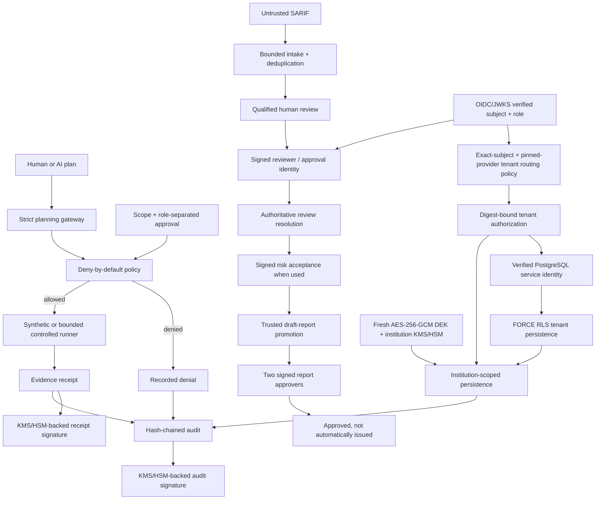

# FinRedOps

**Governance-first AI-assisted security testing orchestration for regulated financial institutions.**

[](https://github.com/bilgekayali/finredops/actions/workflows/ci.yml)
[](LICENSE)
[](pyproject.toml)
[](docs/SAFETY_BOUNDARY.md)

FinRedOps is an open-source control-plane prototype for teams that need to use
AI in security-testing workflows without allowing a model to decide what may
run. Models may propose typed actions; deterministic policy enforces scope,
time, separation of duties, immutable approvals, and a closed action catalog.

> [!IMPORTANT]
> **Version 0.8.3** keeps simulation as the safe default and preserves the
> bounded active-validation, signed-decision and report-issuance boundaries. It
> extends v0.8.2 authenticated tenant routing with an optional PostgreSQL
> persistence boundary: tenant identity is independently resolved from the
> authenticated database `session_user`, runtime accounts are checked for safe
> role attributes and exact read/write membership, and snapshot/audit/idempotency
> tables run with enabled + forced row-level security. PostgreSQL protected
> payloads still require the v0.8.1 institution-owned envelope-encryption path.
> An application tenant authorization and the database-resolved institution must
> agree before a PostgreSQL store is returned.

FinRedOps is **not** a general-purpose exploit framework, autonomous penetration
tester, legal opinion, regulatory acceptance decision, independent audit, or
compliance certificate.

## Example reviewed security report

The repository contains a readable synthetic output of the governed
**SARIF → qualified review → draft report** workflow:

**[Open the example security report](EXAMPLE_SECURITY_REPORT.md)**

The example contains no live-target data and remains a `draft`,
human-approval-required audit-support artifact.

## Summary

In regulated environments, “the AI decided to run it” is not an acceptable
authorization model. A defensible workflow requires explicit rules of
engagement, accountable people, constrained execution, evidence minimization,
reversible controls, and an audit trail that can be independently reviewed.



## Regulatory & security assurance coverage

FinRedOps analyzes security evidence and draft assurance conclusions against a
combination of **implemented financial-sector regulatory/control mappings** and
**international security-testing, privacy, operational-resilience and AI-risk
baselines**. Framework names are not decorative report labels: where structured
support exists, findings can be linked to control identifiers, applicability,
evidence and human-reviewed conclusions.

| Framework / authority | How FinRedOps uses it today |
|---|---|
| **BDDK** | Implemented Turkish banking regulatory crosswalk/applicability and penetration-testing assurance context |
| **SPK VII-128.10** | Implemented capital-markets information-systems crosswalk/applicability |
| **KVKK 6698** | Implemented personal-data security crosswalk/applicability and evidence-minimization context |
| **TSE / TS 13638/T2** | Public penetration-testing prerequisites and licensed-clause evidence boundary |
| **ISO/IEC 27001:2022 & 27002:2022** | ISMS/control applicability and control-oriented assurance mapping; no certification claim |
| **NIST SP 800-115** | Technical security-testing and assessment methodology baseline |
| **OWASP ASVS 5.0** | Application-security verification baseline and finding/control tagging; deeper versioned requirement coverage is on the roadmap |
| **GDPR — Regulation (EU) 2016/679** | EU privacy/security, minimization and evidence-handling analysis baseline; no clause-level compliance claim |
| **DORA — Regulation (EU) 2022/2554** | Financial-sector ICT risk, operational-resilience and TLPT analysis baseline |
| **TIBER-EU** | Intelligence-led testing governance and human-accountability baseline |
| **NIST AI RMF** | AI-assisted workflow governance, traceability and human-oversight baseline |
| **MITRE ATT&CK** | Adversary-behavior and controlled-emulation planning reference |
| **OASIS SARIF 2.1.0** | Implemented bounded machine-finding intake and canonical review queue |

The intended assurance chain is:

```text
security evidence
    -> bounded normalization
    -> qualified human disposition
    -> external OIDC/JWKS subject + role verification when used
    -> signed identity + engagement binding
    -> authoritative review lifecycle resolution
    -> signed business risk acceptance when applicable
    -> technical + business impact
    -> regulatory / standard / requirement references
    -> human-confirmed applicability
    -> trusted draft assurance conclusion
    -> two signed human report approvals
```

This does **not** mean FinRedOps certifies compliance with BDDK, SPK, KVKK,
GDPR, DORA, TSE or ISO requirements. It provides structured analysis,
traceability and audit-support evidence while keeping legal applicability,
regulatory acceptance, certification and final approval with authorized humans.

See **[Regulatory and security assurance baseline](docs/ASSURANCE_BASELINE.md)**
for the detailed coverage matrix, implementation status and official reference
sources.

## Core control model

| Boundary | v0.8.3 behavior |
|---|---|
| AI authority | May propose typed JSON only; cannot authorize or execute |
| Target scope | Exact hostname, IP, or CIDR allowlist; exclusions win |
| Action scope | Closed typed catalog; no free-form command field |
| Approvals | Role-separated, digest-bound, time-limited human decisions |
| Execution | Simulation by default; optional one-request TLS `HEAD` validation on approved non-production targets |
| Active boundary | No redirects, response-body collection, discovery, crawling, payloads, credentials, shell, or production active tests |
| Evidence handling | Deterministic minimization and redaction of likely sensitive identifiers |
| Machine findings | Bounded SARIF 2.1.0 intake with stable fingerprints and mandatory review |
| Finding disposition | Qualified-tester decision with evidence, final severity, impact, recommendation, and control mapping |
| Reviewer identity | External Ed25519 assertion verification; subject/role bound to engagement, intake, finding and immutable review digest |
| External IdP identity | Offline OIDC ID-token + supplied-JWKS verification; pinned issuer/client/alg policy, nonce, ACR, authentication age and role claims |
| OIDC decision binding | Verified OIDC `sub` + role bound to signed reviewer/lifecycle or business/report approval object; aggregate resolver requires exact coverage |
| Review lifecycle | Signed `review_governor` supersession/revocation; history is preserved and parallel/orphan/cyclic chains fail closed |
| Authoritative review | Trusted promotion receives only the current cryptographically verified review for each finding |
| Risk acceptance | Separate `business_risk_owner`; acceptance signature is bound to acceptance digest + trusted-review-resolution digest |
| Approval trust roots | Dedicated public-key bundle; reviewer keys cannot authorize business risk or report approval |
| Report approval | Exactly two distinct `report_approver` signatures bound to source draft digest + trusted-promotion digest |
| Tenant persistence | Store handle binds one institution; snapshots/audit/idempotency use institution-scoped composite keys |
| Authenticated tenant routing | Verified OIDC provider + pinned provider-config digest + exact subject grant + current policy/context digests + closed capabilities; stored authorization is revalidated before use |
| PostgreSQL tenant source | Production DB path resolves institution from authenticated `session_user` through an administrator-owned registry; no client-selected tenant GUC |
| Database RLS | Snapshot/audit/idempotency tables use PostgreSQL `ENABLE ROW LEVEL SECURITY` + `FORCE ROW LEVEL SECURITY`; live catalog verification is required before use |
| Service-account isolation | Exact reader-only or writer-only runtime membership; superuser, `BYPASSRLS`, owner membership and unsafe role attributes fail closed |
| Authorized PostgreSQL bridge | Application tenant authorization and independently database-resolved institution/access must agree |
| Authorized store writes | `store_write` capability plus institution crypto provider required, preventing silent plaintext bypass of v0.8.1 protection |
| Institution envelope encryption | Fresh per-record AES-256-GCM DEK; DEK wrapped by matching institution KMS/HSM provider; tenant/object context authenticated |
| Key-backed evidence | Audit-chain and execution-receipt digests can be signed/verified through the institution `audit_signing` key |
| Concrete KMS adapter | AWS KMS `Encrypt`/`Decrypt` + `Sign`/`Verify`; AWS credentials/key policy remain outside FinRedOps |
| Regulatory assurance | BDDK, SPK, KVKK, TSE and ISO applicability/crosswalk support plus international analysis baselines |
| Draft promotion | Complete review set plus human-supplied asset, owner, and due date; never issues a report |
| Operator workflow | One CLI surface for legacy commands, trust verification, signed approvals, OIDC binding, authenticated tenant routing, PostgreSQL runtime verification, promotion and synthetic demonstration |
| Release integrity | Wheel/sdist checksums, packaged examples, clean-wheel smoke test, version-tag binding, GitHub/Sigstore provenance |
| Reporting | Audit-support report templates and deterministic validation |
| Accountability | Append-only hash chain, optional provider-backed signatures and offline-verifiable artifacts |

## v0.6 end-to-end operator workflow

Install the package in editable mode:

```bash
python -m pip install -e .
```

### 1. Import scanner evidence

```bash
finredops import-sarif examples/synthetic_sast.sarif.json \
  --output work/finding-intake.json
finredops validate-intake work/finding-intake.json
```

### 2. Review every candidate

```bash
finredops finding-review-template \
  --intake work/finding-intake.json \
  --finding-id FRX-SARIF-REPLACE-ME \
  --assessment-type vendor_source_code_review \
  --output work/review-draft.json

finredops finalize-finding-review \
  --intake work/finding-intake.json \
  --draft work/review-draft.json \
  --output work/review.json
```

Every candidate must receive one finalized human disposition before report
promotion can proceed.

### 3. Create the reviewed-report specification

```bash
finredops reviewed-report-spec-template \
  --intake work/finding-intake.json \
  --assessment-type vendor_source_code_review \
  --review work/review-1.json \
  --review work/review-2.json \
  --output work/reviewed-report-spec.json
```

The generated template is intentionally incomplete. The operator must replace
all `TODO` and date placeholders with accountable assessment metadata.
FinRedOps refuses to promote an unfinished template.

### 4. Promote reviewed findings into a draft report

```bash
finredops promote-reviewed-report \
  --intake work/finding-intake.json \
  --review work/review-1.json \
  --review work/review-2.json \
  --spec work/reviewed-report-spec.json \
  --output-dir work/reviewed-report
```

The legacy reviewed-report promotion path remains available for compatibility.
For signed reviewer and risk-acceptance enforcement use the trusted promotion
path described below.

The command produces:

```text
regulatory-report.json
regulatory-report.md
promotion-manifest.json
```

Existing operator outputs are not overwritten. The resulting report is always
`draft` and remains `ready_for_issue: false` until separate human report
approvals are provided.

### 5. Validate and render independently

```bash
finredops validate-report work/reviewed-report/regulatory-report.json
finredops render-report work/reviewed-report/regulatory-report.json \
  --output work/reviewed-report/verified-report.md
```

For the complete sequence, see
**[v0.6 Operator Workflow](docs/OPERATOR_WORKFLOW.md)**.

## v0.7 signed reviewer trust and lifecycle

v0.7 adds cryptographic identity binding **without putting private keys inside
FinRedOps**. A qualified review or lifecycle event receives a short-lived,
externally produced Ed25519 signature assertion. FinRedOps verifies that
assertion against a configured public-key trust bundle and binds it to the exact
engagement, intake batch, finding and immutable object digest.

Create an external signing request for a finalized review:

```bash
finredops identity-assertion-request \
  --intake work/finding-intake.json \
  --review work/review.json \
  --engagement-id FRX-ENGAGEMENT-001 \
  --issuer idp.example-bank.test \
  --key-id reviewer-key-2026 \
  --issued-at 2026-08-13T09:00:00Z \
  --expires-at 2026-08-13T10:00:00Z \
  --output work/review-signing-request.json
```

The external signer returns an Ed25519 signature; FinRedOps attaches it with
`finalize-identity-assertion`, then verifies it only when the protected review,
trust bundle and engagement context are supplied.

Review decisions are never edited in place. A separately signed
`review_governor` lifecycle event can `supersede` an old review with a new one or
`revoke` it without deleting history. `verify-review-trust` rejects invalid
signatures, engagement replay, role/subject mismatch, digest tampering, cycles,
branches and orphan histories.

```bash
finredops verify-review-trust \
  --intake work/finding-intake.json \
  --review work/review-a.json \
  --review work/review-b.json \
  --lifecycle-event work/lifecycle-event.json \
  --identity-assertion work/review-a.assertion.json \
  --identity-assertion work/review-b.assertion.json \
  --identity-assertion work/lifecycle.assertion.json \
  --trust-bundle trust/reviewer-trust.json \
  --engagement-id FRX-ENGAGEMENT-001 \
  --as-of 2026-08-13T10:30:00Z
```

`promote-trusted-reviewed-report` performs the same trust resolution before
calling the existing draft-report promotion boundary. Only current authoritative
signed reviews are passed forward. If business risk acceptance is supplied,
v0.7.1 additionally requires a dedicated approval trust bundle and a valid
signed acceptance for every acceptance record. The output can include
`signed-risk-acceptance-resolution.json` in addition to `trust-resolution.json`
and `trusted-promotion-manifest.json`. The report remains a `draft`.

Provider-neutral Ed25519 signatures remain independently verifiable. v0.7.2
adds the separate OIDC/JWKS layer described below when an operator needs evidence
that the signed `subject` and role were backed by a verified external IdP ID
token. Existing `trust-resolution.json` artifacts do not silently change their
meaning; OIDC protocol evidence is carried in its own verification/binding
artifacts.

See **[Reviewer trust, identity binding and lifecycle](docs/TRUST_IDENTITY.md)**
for the reviewer trust boundary and lifecycle model.

## v0.7.1 signed business and report approvals

Approval keys are kept in a **separate** `approval-trust-bundle` with only
`business_risk_owner` and `report_approver` roles. This prevents reviewer trust
keys from being reused as business or final-report approval credentials.

A signed risk acceptance is bound to both the immutable `RiskAcceptance` digest
and the current trusted-review-resolution digest. An accepted-risk finding cannot
enter the trusted draft report path without that signature.

A trusted draft report is approved only after **exactly two distinct**
`report_approver` signatures are verified against the source report digest and
`trusted_promotion_digest`:

```bash
finredops approve-trusted-report \
  --report work/trusted-report/regulatory-report.json \
  --trusted-promotion-manifest work/trusted-report/trusted-promotion-manifest.json \
  --approval-signature work/report-approval-1.json \
  --approval-signature work/report-approval-2.json \
  --approval-trust-bundle trust/approval-trust.json \
  --engagement-id FRX-ENGAGEMENT-001 \
  --as-of 2026-08-13T11:00:00Z \
  --output-dir work/approved-report
```

Outputs:

```text
approved-regulatory-report.json
approved-regulatory-report.md
signed-report-approval.json
```

The derived report has `status: approved` and can satisfy the existing
`ready_for_issue` structural check because its two `human_approvals` are verified
signature ids. This command **does not issue, transmit, file, or submit the
report**; `signed-report-approval.json` always records `report_issued: false`.

See **[Signed business and report approvals](docs/SIGNED_APPROVALS.md)** for the
full signing workflow and trust boundaries.

## v0.7.2 offline OIDC/JWKS identity binding

v0.7.2 verifies an external OpenID Provider ID token without adding autonomous
network access to FinRedOps. The operator supplies a pinned provider config, a
bounded JWKS export, the compact ID token and the expected authentication nonce.

```bash
finredops verify-oidc-id-token \
  --provider-config trust/oidc-provider.json \
  --jwks trust/idp-jwks.json \
  --id-token work/id-token.jwt \
  --expected-nonce "$OIDC_NONCE" \
  --as-of 2026-08-13T10:30:00Z \
  --output work/oidc-verification.json
```

The verifier checks the cryptographic signature plus exact issuer/client
binding, configured asymmetric algorithm allow-list, `kid`, nonce, token and
authentication age, ACR and the configured FinRedOps role claim. The output
stores SHA-256 token/JWKS/config digests and minimized claims; the raw ID token is
not retained.

Bind the verified IdP identity to an existing signed reviewer or approval object:

```bash
finredops bind-oidc-identity \
  --verification work/oidc-verification.json \
  --identity-assertion work/reviewer.assertion.json \
  --as-of 2026-08-13T10:30:00Z \
  --output work/reviewer.oidc-binding.json
```

For an entire assessment identity chain, `verify-oidc-workflow-bindings`
requires exact one-for-one coverage of all supplied signed reviewer/lifecycle and
business/report approval objects. A successful resolution records
`external_idp_protocol_verified: true` and `exact_binding_coverage: true`.

No `.well-known` discovery or remote JWKS retrieval occurs in this path. This
keeps verification deterministic and prevents IdP metadata URLs from becoming
an implicit network capability.

See **[OIDC / JWKS identity verification](docs/OIDC_IDENTITY.md)** for the full
provider contract, validation rules, role binding and remaining limitations.

## v0.8.0 tenant isolation and institution key boundaries

The SQLite governance store binds every handle to one `institution_id`.
Snapshots, audit events and idempotency records use composite institution-scoped
keys, so the same engagement or request identifier can exist independently in
two institutions. Schema-v1 data is migrated transactionally into the explicit
`default` institution.

Create and validate an institution-owned key-reference context:

```bash
finredops institution-context-template \
  --output institution-security-context.json

finredops validate-institution-context \
  institution-security-context.json
```

The context contains only opaque provider references and a deterministic digest.
It rejects obvious private-key material and requires one active data-encryption
reference and one active audit-signing reference.

Verify one institution-scoped persisted audit chain:

```bash
finredops verify-tenant-store \
  finredops.db \
  FRX-ENGAGEMENT-001 \
  --institution-id bank-a
```

Tenant namespaces are supplemented by the authenticated v0.8.2 routing boundary
and the optional v0.8.3 PostgreSQL database RLS boundary described below. SQLite
remains the local/demo persistence path rather than the database-engine RLS path.

See **[Tenant isolation and institution-owned key boundaries](docs/TENANT_ISOLATION.md)**
for migration behavior, key custody references, security properties and explicit
non-claims.

## v0.8.1 KMS/HSM envelope encryption and signed evidence

v0.8.1 turns the v0.8 key-reference boundary into an executable cryptographic
provider interface. When a matching institution security context and
`KmsHsmProvider` are supplied, the SQLite store encrypts new snapshot and audit
payloads before persistence with a fresh per-record AES-256-GCM DEK. The DEK is
wrapped by the institution provider, and the stored envelope is bound to the
institution and exact object context through authenticated data.

Legacy plaintext records remain visibly `plaintext` until an explicit
`encrypt_existing_records()` maintenance operation rewrites them. Store metadata
reports encrypted/plaintext counts and only sets `encryption_at_rest_verified`
when the configured institution has protected records and no remaining legacy
plaintext snapshot/audit payloads.

The same provider boundary signs canonical SHA-256 targets for audit chains and
execution receipts. Signatures bind the institution, exact key reference,
object digest and signing time. A modified/extended audit chain or modified
receipt therefore cannot reuse the old signature.

A concrete `AwsKmsProvider` is included. Install its optional dependency with:

```bash
python -m pip install 'finredops[aws-kms]'
```

It uses AWS KMS `Encrypt`/`Decrypt` with an encryption context and `Sign`/`Verify`
with explicitly configured SHA-256 signing algorithms. AWS credentials, IAM/key
policy, key creation and key lifecycle remain institution responsibilities.

Other KMS/HSM provider categories are represented by the protocol but do not
all have built-in v0.8.1 adapters. See
**[Institution-owned KMS/HSM envelope encryption and evidence signatures](docs/KMS_ENVELOPE_SIGNING.md)**
for the cryptographic model, rotation semantics and explicit limitations.

## v0.8.2 authenticated tenant routing and authorization

v0.8.2 consumes the minimized v0.7.2 OIDC verification artifact and an explicit
institution routing policy. One policy binds one OIDC provider **and the exact
provider-config digest** to one institution and contains exact-subject grants;
wildcards and implicit membership are not supported. Requested access is limited
to the closed capability set `store_read`, `store_write`, `audit_verify`, and
`crypto_use`.

Create a conservative policy template, authorize a route, and revalidate it:

```bash
finredops tenant-routing-policy-template \
  --institution-context institution-security-context.json \
  --oidc-verification oidc-verification.json \
  --output tenant-routing-policy.json

finredops authorize-tenant-route \
  --policy tenant-routing-policy.json \
  --institution-context institution-security-context.json \
  --oidc-verification oidc-verification.json \
  --capability store_read \
  --capability audit_verify \
  --as-of 2026-08-13T10:00:00Z \
  --output tenant-authorization.json

finredops verify-tenant-authorization \
  --authorization tenant-authorization.json \
  --policy tenant-routing-policy.json \
  --institution-context institution-security-context.json \
  --oidc-verification oidc-verification.json \
  --as-of 2026-08-13T10:15:00Z
```

The authorization binds the exact OIDC verification digest, policy digest,
current institution-context digest, effective role intersection and capability
subset. The policy digest itself pins the OIDC provider configuration. It
expires with the source identity. A saved authorization is not trusted alone:
current source artifacts are required again. The authorized store session derives
the institution namespace from those validated bindings, and writes require the
institution cryptographic provider so the envelope-encryption path cannot be
silently bypassed.

See **[Authenticated tenant routing and authorization](docs/TENANT_AUTHORIZATION.md)**
for the full policy model, fail-closed rules and production non-claims.

## v0.8.3 PostgreSQL RLS and service-account isolation

v0.8.3 adds an optional PostgreSQL persistence backend that independently derives
the tenant from the authenticated database `session_user`. The administrator-owned
registry maps one existing LOGIN service role to exactly one institution and one
access mode. Runtime roles with superuser, `BYPASSRLS`, owner membership or other
unsafe role attributes are rejected before FinRedOps accepts the connection.

Generate installation and service-account mapping SQL:

```bash
finredops postgres-rls-install-sql \
  --output postgres-rls-install.sql

finredops postgres-service-account-sql \
  --service-role bank_a_finredops_writer \
  --institution bank-a \
  --access write \
  --output bank-a-writer.sql
```

Runtime verification reads the DSN from an environment variable rather than a
command-line credential:

```bash
export FINREDOPS_POSTGRES_DSN='postgresql://...'
finredops verify-postgres-runtime \
  --institution bank-a \
  --access write \
  --output postgres-runtime-assessment.json
```

The verifier checks database role attributes/membership, the exact registry
mapping, installation contract digest, table RLS + FORCE RLS state, expected
policies and effective SELECT/INSERT/UPDATE/DELETE privileges. A successful live
assessment sets `database_rls_verified`, `service_account_isolation_verified`
and `rls_bypass_role_verified_absent` to true.

`PostgresGovernanceStore` still requires the institution security context and
matching KMS/HSM provider; protected snapshot and audit payloads are written only
as v0.8.1 `envelope_v1` artifacts. The application bridge does not accept an
institution argument: the v0.8.2 `AuthorizedTenantSession` institution must
independently match the database service account's resolved institution.

See **[PostgreSQL RLS and service-account boundary](docs/POSTGRES_RLS.md)** for
the threat model, administrator workflow, live verification and explicit
privileged-DBA/non-production claims.

## Reproduce the reviewed-report demo from an installed wheel

The synthetic engagement, plan, and SARIF input ship as package data. A source
checkout is not required for the reviewed-report demo:

```bash
finredops export-examples --output-dir finredops-examples
finredops demo-reviewed-report --output-dir demo-output/reviewed
finredops validate-report demo-output/reviewed/regulatory-report.json
```

`demo-reviewed-report` uses the packaged synthetic SARIF by default. An explicit
SARIF file may still be supplied with `--sarif`.

The demo creates canonical intake, two finalized synthetic reviews, one promoted
finding, a draft JSON/Markdown report, and a promotion manifest. No live target
is contacted.

## Release integrity and provenance

Tagged releases build a wheel and source distribution, smoke-test the installed
wheel in a clean environment with declared runtime dependencies, generate a
`CHECKSUMS.sha256` manifest, and create GitHub/Sigstore artifact provenance.

Local checksum verification:

```bash
finredops verify-release-checksums \
  --manifest ./CHECKSUMS.sha256 \
  --directory .
```

This verifies local SHA-256 integrity only. It deliberately does **not** claim
that provenance has been verified.

Verify the build origin separately with GitHub CLI artifact attestations:

```bash
gh attestation verify finredops-0.8.3-py3-none-any.whl \
  --repo bilgekayali/finredops
```

See **[Release integrity and provenance](docs/RELEASE_INTEGRITY.md)** for the
trust model, tag/version binding, clean-wheel test, and verification boundaries.

## Existing visual and assurance demo

```bash
python -m finredops demo --output demo-output
python -m finredops verify-audit demo-output/audit.jsonl
python -m finredops verify-store demo-output/finredops.db FRX-DEMO-2026-001
python -m finredops verify-tenant-store demo-output/finredops.db FRX-DEMO-2026-001 --institution-id default
python -m finredops validate-report demo-output/regulatory-report.json
python -m finredops validate-applicability demo-output/applicability.json
python -m finredops validate-evidence-manifest demo-output/evidence-manifest.json
python -m finredops verify-bundle demo-output/audit-dossier.zip
python -m finredops render-report demo-output/regulatory-report.json \
  --output demo-output/verified-report.md
python -m finredops serve --host 127.0.0.1 --port 8080
```

The demo includes a synthetic engagement, digest-bound approvals, policy
decisions, evidence receipts, an intentional denial, an operations dashboard,
SQLite persistence, a BDDK/SPK/KVKK/TSE/ISO regulatory crosswalk, international
security/resilience analysis baselines, evidence custody, and an offline review
dossier.

## Repository map

```text
src/finredops/
  planner.py              strict AI-to-control-plane boundary
  policy.py               deterministic deny-by-default authorization
  catalog.py              closed catalog of typed actions
  runner.py               network-free synthetic evidence runner
  validation.py           optional bounded active validation
  intake.py               bounded SARIF parser and canonical candidates
  review.py               qualified disposition and role-separated risk acceptance
  trust.py                reviewer identity verification and authoritative review lifecycle
  trust_cli.py            v0.7 trust/lifecycle and trusted-promotion commands
  approval_keys.py        separate business/report public-key trust roots
  signed_approvals.py     signed risk-acceptance and report-approval verification
  signed_approval_cli.py  v0.7.1 signed approval operator commands
  oidc_identity.py        offline OIDC/JWKS verification and signed-identity binding
  oidc_cli.py             v0.7.2 external-IdP operator commands
  tenant_auth.py          exact-subject authenticated tenant authorization and store session
  tenant_auth_cli.py      v0.8.2 tenant routing policy/authorization commands
  postgres_rls.py         PostgreSQL RLS contract, live verifier and encrypted store
  postgres_tenant.py      application tenant authorization to verified PostgreSQL bridge
  postgres_cli.py         v0.8.3 RLS/service-account installation and verification commands
  institution.py          institution security context and opaque KMS/HSM references
  crypto_provider.py      provider-neutral KMS/HSM wrap/unwrap/sign/verify boundary
  aws_kms.py              AWS KMS production adapter
  envelope.py             per-record AES-256-GCM envelope encryption
  signed_evidence.py      KMS/HSM-backed audit-chain and receipt signatures
  hardening_cli.py        v0.8 tenant/key-boundary operator commands
  promotion.py            explicit reviewed-finding to draft-report boundary
  operator_cli.py         reviewed-report and release-integrity commands
  entrypoint.py           top-level operator/trust/approval/OIDC/tenant/PostgreSQL/hardening router
  release_integrity.py    packaged examples and strict local checksum verification
  examples/               installed-wheel synthetic engagement, plan, and SARIF
  evidence.py             sensitive-data minimization boundary
  custody.py              metadata-only evidence registry and custody hash chain
  audit.py                append-only SHA-256 audit chain
  store.py                institution-scoped, optional envelope-encrypted SQLite persistence
  service.py              engagement and approval state machine
  profiles.py             financial-institution preflight policy
  regulations.py          versioned Turkish regulatory control registry
  applicability.py        human-confirmed regulatory/standards scope
  reporting.py            audit-support validation, crosswalk, and renderer
  diffing.py              report revision and remediation delta
  bundle.py               deterministic audit dossier builder and verifier
  api.py                  loopback-first read-only API
  dashboard.py            self-contained operations interface
schemas/                  versioned data contracts, including reviewer, approval, OIDC, tenant authorization, PostgreSQL RLS/runtime, institution, envelope and evidence-signature contracts
docs/                     architecture, safety, assurance, operator, release, trust, tenant and PostgreSQL hardening workflow
examples/                 source-tree synthetic reserved-namespace inputs
tests/                    policy, integrity, trust, approval, OIDC, tenant authorization, PostgreSQL RLS, KMS/envelope, packaging and end-to-end tests
```

## Trust claims—and limits

FinRedOps demonstrates technical patterns that can support governed security
testing. Hash chaining alone provides **tamper evidence**, not non-repudiation.
SQLite remains demonstration/local persistence rather than a production
multi-tenant system of record. Regulatory mappings do not establish legal
applicability, certification, or compliance.

Release checksum validation establishes local byte integrity relative to the
supplied manifest; it does not establish build origin. GitHub/Sigstore artifact
attestations address build provenance only when the consumer verifies them.
The v0.7 reviewer trust layer verifies Ed25519 reviewer/lifecycle assertions
against configured public keys and exact engagement/object bindings. v0.7.1
separately verifies business-risk-owner and report-approver signatures using
dedicated approval trust roots and context-bound object digests.

v0.7.2 can additionally prove that a supplied external OIDC ID token was
cryptographically validated against pinned provider policy and supplied JWKS,
and that its `sub` + FinRedOps role claims were exactly bound to signed workflow
identities. It does **not** fetch or continuously refresh IdP metadata, interpret
the business meaning of an ACR value, validate SAML/device posture, or prove
regulatory acceptance.

v0.8.1 can perform real application-layer envelope encryption and provider-backed
audit/receipt signing when a matching `KmsHsmProvider` is configured. The AWS KMS
adapter is built in; other KMS/HSM families require separate adapter
implementations. FinRedOps does not claim that a configured key reference proves
correct IAM/key policy, does not create/export institution keys, cannot guarantee
zeroization of every transient Python byte copy, and does not yet provide
external immutable audit anchoring.

v0.8.2 authorizes one verified OIDC subject/provider configuration to one
institution through a digest-bound routing policy and closed capability set. It
rejects stale policy or institution context, changed provider configuration,
cross-tenant/provider/subject replay and capability escalation. It does **not**
provide API-gateway authentication, SCIM/group synchronization, or independently
signed routing-policy change approval.

v0.8.3 adds a PostgreSQL database-engine RLS/service-account boundary and a live
catalog verification artifact. The runtime claim applies only after the current
connection passes the verifier. PostgreSQL superuser/DBA, backup/recovery,
service-account credential provisioning/rotation, pooler isolation, cloud DB
IAM and KMS IAM/key-policy correctness remain institution responsibilities.
FinRedOps also does not automatically issue, deliver or submit an approved
report.

## Reference baseline

The design and analysis model are informed by, but do not claim conformance with:

- [BDDK Bankaların Bilgi Sistemleri ve Elektronik Bankacılık Hizmetleri Hakkında Yönetmelik](https://www.resmigazete.gov.tr/eskiler/2020/03/20200315-10.htm)
- [BDDK Bilgi Sistemlerine İlişkin Sızma Testleri Hakkında Genelge 2012/1](https://www.bddk.org.tr/Mevzuat/DokumanGetir/915)
- [SPK Bilgi Sistemleri Yönetimine İlişkin Usul ve Esaslar Tebliği VII-128.10](https://www.resmigazete.gov.tr/eskiler/2025/03/20250313-8.htm)
- [KVKK 6698 sayılı Kanun Madde 12](https://www.kvkk.gov.tr/Icerik/2097/Kanun-doc) and [Personal Data Security Guide](https://www.kvkk.gov.tr/SharedFolderServer/CMSFiles/7512d0d4-f345-41cb-bc5b-8d5cf125e3a1.pdf)
- [TSE Bilişim Teknolojileri Sızma Testleri](https://www.tse.org.tr/sizma-testleri/) and [TS 13638/T2 firm certification prerequisites](https://www.tse.org.tr/sizma-testi-belgelendirmesi/)
- [ISO/IEC 27001:2022](https://www.iso.org/standard/27001) and [ISO/IEC 27002:2022](https://www.iso.org/standard/75652.html)
- [NIST SP 800-115 — Technical Guide to Information Security Testing and Assessment](https://csrc.nist.gov/pubs/sp/800/115/final)
- [NIST SP 800-38D — GCM authenticated encryption](https://csrc.nist.gov/pubs/sp/800/38/d/final)
- [NIST AI RMF Generative AI Profile](https://www.nist.gov/publications/artificial-intelligence-risk-management-framework-generative-artificial-intelligence)
- [OWASP Application Security Verification Standard](https://owasp.org/www-project-application-security-verification-standard/)
- [GDPR — Regulation (EU) 2016/679](https://eur-lex.europa.eu/eli/reg/2016/679/oj)
- [DORA — Regulation (EU) 2022/2554](https://eur-lex.europa.eu/eli/reg/2022/2554/oj)
- [Commission Delegated Regulation (EU) 2025/1190](https://eur-lex.europa.eu/eli/reg_del/2025/1190/oj/eng)
- [ECB TIBER-EU framework](https://www.ecb.europa.eu/paym/cyber-resilience/tiber-eu/html/index.en.html)
- [MITRE ATT&CK adversary emulation plans](https://attack.mitre.org/resources/adversary-emulation-plans/)
- [OASIS SARIF 2.1.0](https://docs.oasis-open.org/sarif/sarif/v2.1.0/os/sarif-v2.1.0-os.html)
- [OpenID Connect Core 1.0](https://openid.net/specs/openid-connect-core-1_0.html)
- [RFC 7517 — JSON Web Key](https://www.rfc-editor.org/rfc/rfc7517)
- [RFC 7519 — JSON Web Token](https://www.rfc-editor.org/rfc/rfc7519)
- [RFC 8725 — JWT Best Current Practices](https://www.rfc-editor.org/rfc/rfc8725)
- [PostgreSQL Row Security Policies](https://www.postgresql.org/docs/17/ddl-rowsecurity.html)
- [PostgreSQL Database Roles / role attributes](https://www.postgresql.org/docs/17/database-roles.html)

Key documentation:

- [Regulatory and security assurance baseline](docs/ASSURANCE_BASELINE.md)
- [Reviewer trust, identity binding and lifecycle](docs/TRUST_IDENTITY.md)
- [Signed business and report approvals](docs/SIGNED_APPROVALS.md)
- [OIDC / JWKS identity verification](docs/OIDC_IDENTITY.md)
- [Tenant isolation and institution-owned key boundaries](docs/TENANT_ISOLATION.md)
- [Institution-owned KMS/HSM envelope encryption and evidence signatures](docs/KMS_ENVELOPE_SIGNING.md)
- [Authenticated tenant routing and authorization](docs/TENANT_AUTHORIZATION.md)
- [PostgreSQL RLS and service-account boundary](docs/POSTGRES_RLS.md)
- [Safety boundary](docs/SAFETY_BOUNDARY.md)
- [Threat model](docs/THREAT_MODEL.md)
- [Controlled validation](docs/CONTROLLED_VALIDATION.md)
- [Machine finding intake](docs/EVIDENCE_INTAKE.md)
- [Qualified finding review](docs/FINDING_REVIEW.md)
- [Reviewed report promotion](docs/REVIEWED_REPORT_PROMOTION.md)
- [v0.6 Operator Workflow](docs/OPERATOR_WORKFLOW.md)
- [Release integrity and provenance](docs/RELEASE_INTEGRITY.md)
- [Reporting model](docs/REPORTING_MODEL.md)
- [Türkiye regulatory mapping](docs/TURKEY_REGULATORY_MAPPING.md)
- [Applicability](docs/APPLICABILITY.md)
- [Chain of custody](docs/CHAIN_OF_CUSTODY.md)
- [Audit dossier](docs/AUDIT_DOSSIER.md)
- [Roadmap](docs/ROADMAP.md)

## Contributing

Start with [CONTRIBUTING.md](CONTRIBUTING.md). Contributions must preserve the
closed catalog, safe-default execution model, human-approval boundaries, and
controlled-validation limits. Security issues should be reported through the
private vulnerability-reporting process described in [SECURITY.md](SECURITY.md).

Apache-2.0 licensed. Copyright 2026 Bilge Kayalı.
