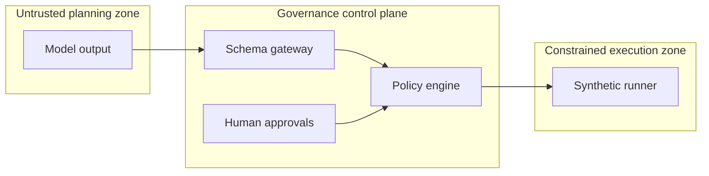
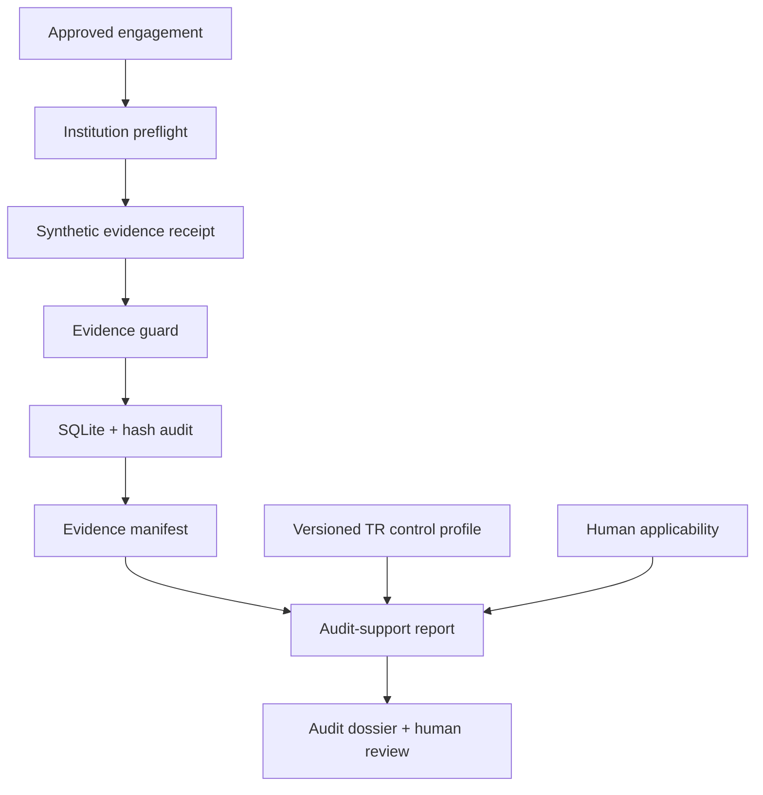

# Architecture

FinRedOps v0.3 is a small reference control plane, not a scanner. Its central
design choice is to separate probabilistic planning from deterministic
authorization and execution.

## Components

1. **Engagement model** records exact assets, explicit exclusions, permitted
   catalog actions, a time window, rate ceiling, critical functions, and
   emergency contacts.
2. **Guarded planning gateway** accepts a limited JSON schema. Unknown fields,
   unknown actions, nested parameters, oversized documents, and malformed
   targets fail closed.
3. **Approval records** bind a named actor and role to the digest of one exact
   engagement or proposal. A later change produces a new digest and invalidates
   prior approvals.
4. **Policy engine** applies scope, exclusion, action, risk, time, parameter,
   role-separation, self-approval, expiry, denial, and kill-switch checks.
5. **Simulation runner** reads a bundled fixture. It does not resolve DNS, open
   sockets, spawn processes, or interpret model text.
6. **Audit chain** links canonicalized events with SHA-256 so offline
   verification can identify alteration or removal inside the chain.
7. **Dashboard** renders a snapshot locally and labels all evidence synthetic.
8. **Institution profile** blocks unsafe scope, risk, contact, rate, and approval
   settings before an engagement can be activated.
9. **Evidence guard** minimizes likely secrets, e-mail addresses, valid IBANs,
   and payment-card identifiers before receipts become immutable.
10. **SQLite store** persists append-only snapshot revisions and refuses audit
    histories that diverge from the exact stored prefix.
11. **Regulatory/report engine** records source-linked control conclusions,
    mandatory test coverage, finding ownership, remediation, and human sign-off.
12. **Read-only API** exposes synthetic state over GET/HEAD only on loopback by
    default; no state-changing endpoint exists.
13. **Applicability engine** records human-confirmed BDDK, SPK, KVKK, TSE and
    ISO scope decisions without inferring legal applicability from an entity label.
14. **Evidence custody registry** binds opaque evidence locators to content
    digests, custodians, retention metadata and a separate hash chain.
15. **Report delta engine** makes new, missing, closed, reopened and severity or
    control changes explicit between report revisions.
16. **Audit dossier builder** creates a deterministic metadata-only ZIP and
    verifies paths, sizes, digests and embedded documents without extraction.

## Trust boundaries

Model output is untrusted data throughout. It never becomes executable text.
The v0.3 execution zone contains no live adapter.

## State and persistence

The service state machine remains process-local, while v0.2 added a transactional
SQLite export store. Snapshots are immutable revisions; audit events must extend
the stored chain exactly. This is durable demonstration storage, not a complete
multi-tenant system of record. Production still requires authenticated identities,
tenant isolation, institution-owned encryption keys, key-backed signatures,
retention/legal-hold policy, backups, recovery and external audit anchoring.

## Assurance data flow

## Proposed future live boundary

Live passive collection, if ever implemented, should be a separate signed
runner with short-lived workload identity, outbound allowlisting, isolated
workers, an institution-owned policy decision point, and no arbitrary-command
interface. It is intentionally absent from v0.3.
