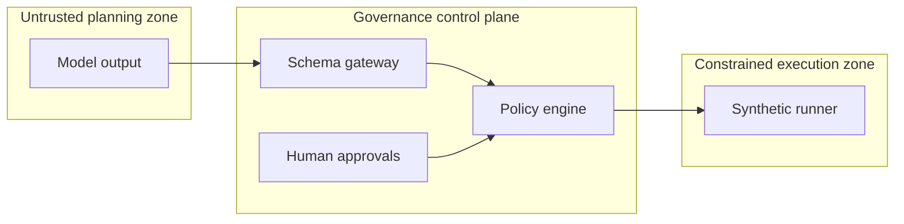

# Architecture

FinRedOps v0.1 is a small reference control plane, not a scanner. Its central
design choice is to separate probabilistic planning from deterministic
authorization and execution.

## Components

1. **Engagement model** records exact assets, explicit exclusions, permitted
   catalog actions, a time window, rate ceiling, critical functions, and
   emergency contacts.
2. **Guarded planning gateway** accepts a limited JSON schema. Unknown fields,
   unknown actions, nested parameters, oversized documents, and malformed
   targets fail closed.
3. **Approval records** bind a named actor and role to the digest of one exact
   engagement or proposal. A later change produces a new digest and invalidates
   prior approvals.
4. **Policy engine** applies scope, exclusion, action, risk, time, parameter,
   role-separation, self-approval, expiry, denial, and kill-switch checks.
5. **Simulation runner** reads a bundled fixture. It does not resolve DNS, open
   sockets, spawn processes, or interpret model text.
6. **Audit chain** links canonicalized events with SHA-256 so offline
   verification can identify alteration or removal inside the chain.
7. **Dashboard** renders a snapshot locally and labels all evidence synthetic.

## Trust boundaries

Model output is untrusted data throughout. It never becomes executable text.
The v0.1 execution zone contains no live adapter.

## State and persistence

The service stores state in memory for clarity and testability. Generated JSON
and JSONL are export artifacts, not a transactional database. A production
design would require authenticated identities, durable append-only storage,
key-backed signatures, tenant isolation, encrypted evidence, retention policy,
and recovery procedures.

## Proposed future live boundary

Live passive collection, if ever implemented, should be a separate signed
runner with short-lived workload identity, outbound allowlisting, isolated
workers, an institution-owned policy decision point, and no arbitrary-command
interface. It is intentionally absent from v0.1.
