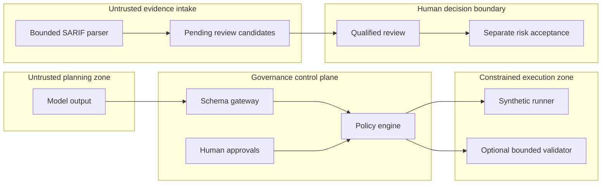
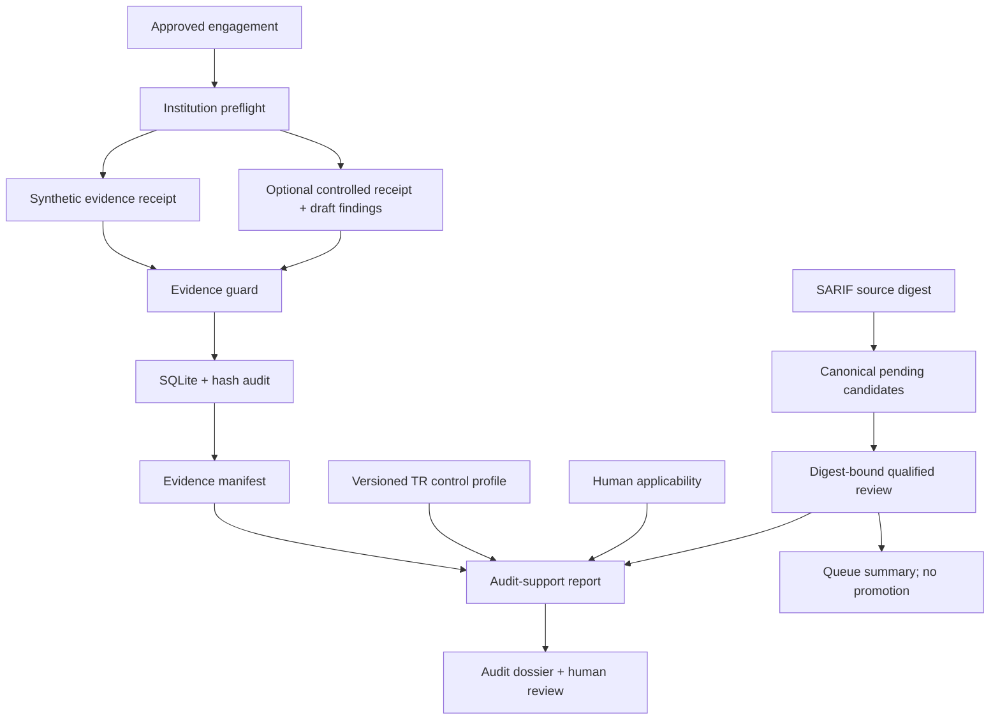

# Architecture

FinRedOps v0.5 is a small reference control plane with one bounded active
validation primitive and one defensive scanner-evidence intake boundary, not a
general-purpose scanner. Its central
design choice is to separate probabilistic planning from deterministic
authorization and execution.

## Components

1. **Engagement model** records exact assets, explicit exclusions, permitted
   catalog actions, a time window, rate ceiling, critical functions, and
   emergency contacts.
2. **Guarded planning gateway** accepts a limited JSON schema. Unknown fields,
   unknown actions, nested parameters, oversized documents, and malformed
   targets fail closed.
3. **Approval records** bind a named actor and role to the digest of one exact
   engagement or proposal. A later change produces a new digest and invalidates
   prior approvals.
4. **Policy engine** applies scope, exclusion, action, risk, time, parameter,
   role-separation, self-approval, expiry, denial, and kill-switch checks.
5. **Simulation runner** reads a bundled fixture. It does not resolve DNS, open
   sockets, spawn processes, or interpret model text.
6. **Controlled-validation runner** is absent by default. When explicitly
   injected, it performs one TLS `HEAD` request to one approved non-production
   target, follows no redirect, collects no body and emits draft findings.
7. **Audit chain** links canonicalized events with SHA-256 so offline
   verification can identify alteration or removal inside the chain.
8. **Dashboard** renders a snapshot locally and distinguishes simulated,
   validated, failed and cancelled execution receipts.
9. **Institution profile** blocks unsafe scope, risk, contact, rate, and approval
   settings before an engagement can be activated.
10. **Evidence guard** minimizes likely secrets, e-mail addresses, valid IBANs,
   and payment-card identifiers before receipts become immutable.
11. **SQLite store** persists append-only snapshot revisions and refuses audit
    histories that diverge from the exact stored prefix.
12. **Regulatory/report engine** records source-linked control conclusions,
    mandatory test coverage, finding ownership, remediation, and human sign-off.
13. **Read-only API** exposes state over GET/HEAD only on loopback by
    default; no state-changing endpoint exists.
14. **Applicability engine** records human-confirmed BDDK, SPK, KVKK, TSE and
    ISO scope decisions without inferring legal applicability from an entity label.
15. **Evidence custody registry** binds opaque evidence locators to content
    digests, custodians, retention metadata and a separate hash chain.
16. **Report delta engine** makes new, missing, closed, reopened and severity or
    control changes explicit between report revisions.
17. **Audit dossier builder** creates a deterministic metadata-only ZIP and
    verifies paths, sizes, digests and embedded documents without extraction.
18. **Finding intake** treats SARIF 2.1.0 as untrusted evidence, applies bounded
    parsing, minimizes sensitive text, normalizes safe locations, correlates
    stable fingerprints and emits only human-review candidates.
19. **Qualified review** binds one tester decision to the exact intake and
    candidate digest and assessment type, separates final human severity from
    machine severity and records evidence-linked false-positive, duplicate and
    applicability outcomes.
20. **Risk disposition** keeps time-bounded business-owner risk acceptance
    separate from the tester and exposes active or expired state in a
    deterministic queue summary without report promotion.

## Trust boundaries

Model output is untrusted data throughout. It never becomes executable text.
The v0.4 active path accepts only typed scalar parameters and remains disabled
unless an integrator injects the bounded runner. The v0.5 intake path never
executes a tool or dereferences an artifact URI; its output cannot bypass the
human report-review boundary.

## State and persistence

The service state machine remains process-local, while v0.2 added a transactional
SQLite export store. Snapshots are immutable revisions; audit events must extend
the stored chain exactly. This is durable demonstration storage, not a complete
multi-tenant system of record. Production still requires authenticated identities,
tenant isolation, institution-owned encryption keys, key-backed signatures,
retention/legal-hold policy, backups, recovery and external audit anchoring.

## Assurance data flow

## Future active boundary

Additional live modules should be separate signed workers with short-lived
workload identity, outbound allowlisting, isolated execution, an
institution-owned policy decision point, and no arbitrary-command interface.
Production testing, authentication flows and invasive validation remain absent
from v0.5 and require independent threat, legal and control review.
