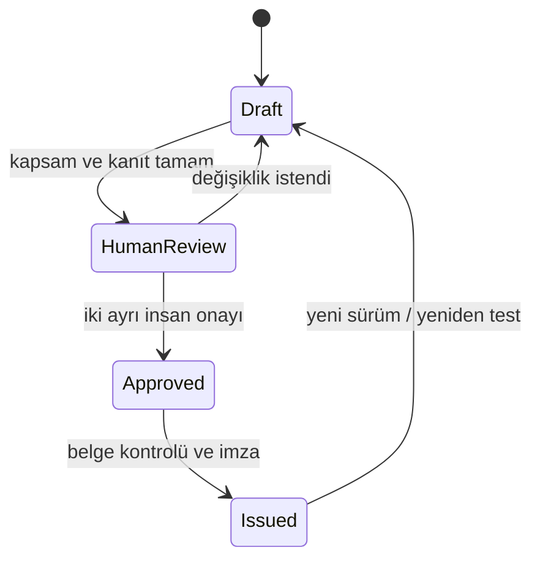

# Denetim destek raporlama modeli

FinRedOps v0.3 üç ana çalışma için aynı izlenebilir rapor omurgasını kullanır:
yıllık banka sızma testi, tedarikçi kaynak kod güvenlik incelemesi ve tedarikçi
uygulama sızma testi. Dördüncü tür, önceki bulguların giderim doğrulamasıdır.

## Rapor yaşam döngüsü

Model bir taslağı yapısal olarak doğrulayabilir; ancak insan onayı bulunmayan
taslağı “yayıma hazır” saymaz. Bir otomasyon veya model kendi raporunu onaylayamaz.

## Asgari belge bölümleri

- rapor kimliği, sınıflandırma, dönem ve değişmez özet;
- kuruluş, test ekibi, lider, yeterlilik ve bağımsızlık beyanı;
- imzalı çalışma kuralları referansı, kesin kapsam ve hariç tutulanlar;
- yöntem, test edilen zorunlu alanlar ve açık sınırlamalar;
- güvenli bulgu özeti, iş etkisi, öneri, sorumlu ve hedef tarih;
- ham veriyi içermeyen kanıt URI'leri;
- BDDK, SPK, KVKK, TSE ve ISO/IEC kontrol sonuçları;
- yeniden test tarihi, sonucu ve ayrı kapanış kanıtı;
- iki ayrı insan onay kaydı.

## Kanıt modeli

Rapor yalnızca `evidence://`, `attachment://` ve
`qualification-evidence://` biçiminde opak referans taşır. Kimlik bilgisi,
müşteri verisi, tam istek/yanıt gövdesi veya exploit tarifi Markdown/JSON rapora
gömülmez. Gerçek kanıt deposu kurumun erişim kontrolü, şifreleme, saklama ve
silme politikası altında ayrıca işletilmelidir.

v0.3 `evidence-manifest.json` ile her opak referans için içerik özeti, boyut,
MIME türü, kaynak sistem, toplayan kişi, zaman, sınıflandırma, kişisel veri
bayrakları ve saklama tarihini kaydeder. Kayıt, erişim, doğrulama, devir,
legal hold ve imha işlemleri ayrı bir SHA-256 gözetim zincirine eklenir.

## Bulgular ve yeniden test

Her bulgu varlık, önem, güvenli teknik özet, iş etkisi, öneri, kanıt ve kontrol
eşlemesi içerir. Yüksek/kritik açık bulguya sorumlu ve hedef tarih atanması
zorunludur. `passed` yeniden test sonucu ancak tarih ve özgün kapanış kanıtıyla
geçerlidir. Böylece testin yapılmasıyla riskin giderilmesi birbirinden ayrılır.

### Makine bulgusu kabul sınırı

v0.5 SARIF sonuçlarını doğrudan `SecurityFinding` kaydına dönüştürmez. İçe
aktarılan her kayıt `pending_review` durumunda, makine tarafından önerilen fakat
nihai olmayan önem/güven değerleriyle ayrı bir kanonik adaydır. Rapor bulgusuna
dönüşüm için yetkin test uzmanının en azından yeniden üretim veya kanıt doğrulama,
yanlış pozitif/tekrar kararı, iş etkisi, nihai önem, öneri, kanıt ve kontrol
eşlemesini kaydetmesi gerekir. v0.5.1 bu uzman kararını aday ve intake digestine
ve seçilen değerlendirme türüne bağlı ayrı bir kayıt olarak uygular; kontrol
referansları o değerlendirme türüne uygulanabilir olmalıdır. Risk kabulü yalnız
doğrulanmış bulgu için,
test uzmanından farklı bir iş riski sahibi, telafi edici kontroller ve en fazla
366 günlük süreyle ayrıca kaydedilir. Özet çıktı açıkça
`report_promotion_performed: false` taşır; kararlar otomatik olarak rapora terfi
ettirilmez ve SARIF alanlarından düzenleyici sonuç çıkarılamaz.

## Düzenleyici çapraz kontrol

Rapor motoru seçilen değerlendirme türüne uygulanabilir tüm profil kontrollerini
listeler ve sonuç kaydı eksikse doğrulamayı durdurur. Koşullu bir mevzuat maddesi
`not_applicable` seçilecekse hukuk/uyum gerekçesi kaydedilmelidir. Ayrıntılı
kaynaklar için [Türkiye düzenleyici eşlemesi](TURKEY_REGULATORY_MAPPING.md)
belgesine bakın.

## Sürüm farkı ve teslim paketi

`compare-reports`, aynı kuruluş ve değerlendirme türüne ait iki raporu kararlı
bulgu/kontrol kimlikleri üzerinden karşılaştırır. Yeni veya kayıp bulguları,
kapanış ve yeniden açılmayı, önem artış/azalışını, yeniden test değişimini ve
kontrol gerileme/iyileşmesini ayrı alanlarda gösterir.

`audit-dossier.zip` raporu, Markdown görünümünü, çapraz kontrolü,
uygulanabilirlik kararını, kanıt manifestini ve denetim zincirini deterministik
bir manifest altında toplar. Ham kanıt içermez. `regulatory_submission` amacı;
güncel profil, tarihli insan uygulanabilirlik onayı, iki farklı rapor onayı,
`issued` durumu, eksiksiz kanıt lokasyonları ve sağlam zincirler olmadan
oluşturulamaz.

## Çıktılar

`finredops demo` aşağıdaki sentetik çıktıları üretir:

- `regulatory-report.md`: insan incelemesine uygun belge;
- `regulatory-report.json`: makinece doğrulanabilir rapor;
- `regulatory-crosswalk.json`: kaynak bağlantılı kontrol/kanıt/bulgu matrisi;
- `applicability.json`: insan onaylı tabiiyet ve şartname kapsam kararları;
- `evidence-manifest.json`: ham veri içermeyen kanıt ve gözetim zinciri;
- `audit-dossier.zip`: deterministik, çevrimdışı doğrulanabilir inceleme paketi;
- `finredops.db`: sürümlü anlık görüntü ve hash zincirli denetim kaydı.

JSON sözleşmeleri `schemas/` altında sürümlenir. Sentetik demo gerçek sızma testi
sonucu, düzenleyici teslim veya uygunluk iddiası olarak kullanılamaz.
