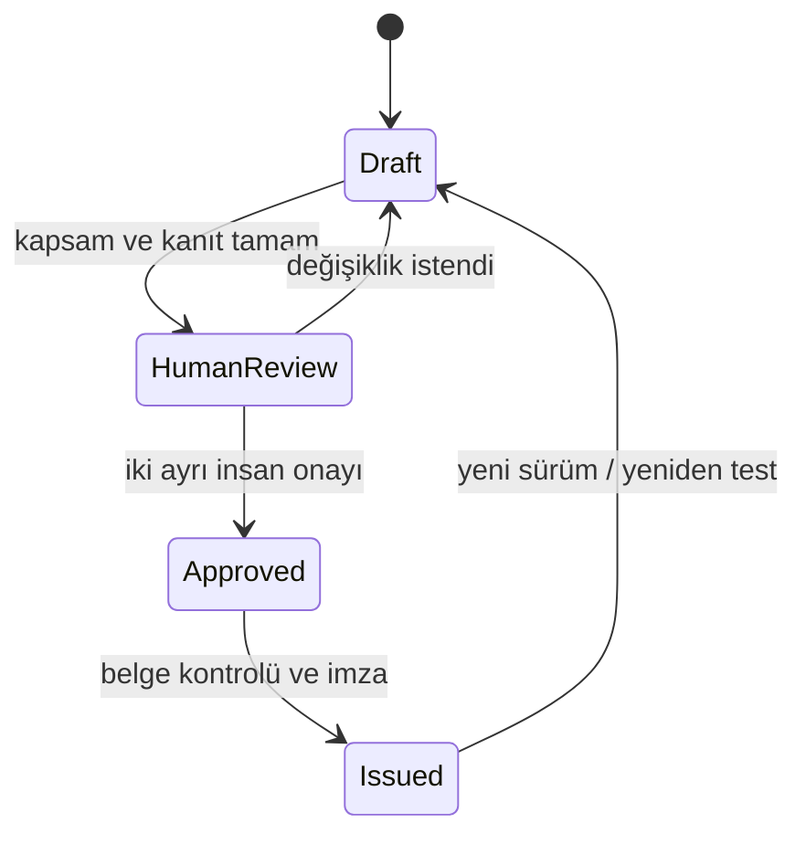

# Denetim destek raporlama modeli

FinRedOps v0.2 üç ana çalışma için aynı izlenebilir rapor omurgasını kullanır:
yıllık banka sızma testi, tedarikçi kaynak kod güvenlik incelemesi ve tedarikçi
uygulama sızma testi. Dördüncü tür, önceki bulguların giderim doğrulamasıdır.

## Rapor yaşam döngüsü

Model bir taslağı yapısal olarak doğrulayabilir; ancak insan onayı bulunmayan
taslağı “yayıma hazır” saymaz. Bir otomasyon veya model kendi raporunu onaylayamaz.

## Asgari belge bölümleri

- rapor kimliği, sınıflandırma, dönem ve değişmez özet;
- kuruluş, test ekibi, lider, yeterlilik ve bağımsızlık beyanı;
- imzalı çalışma kuralları referansı, kesin kapsam ve hariç tutulanlar;
- yöntem, test edilen zorunlu alanlar ve açık sınırlamalar;
- güvenli bulgu özeti, iş etkisi, öneri, sorumlu ve hedef tarih;
- ham veriyi içermeyen kanıt URI'leri;
- BDDK, SPK, KVKK ve ISO/IEC kontrol sonuçları;
- yeniden test tarihi, sonucu ve ayrı kapanış kanıtı;
- iki ayrı insan onay kaydı.

## Kanıt modeli

Rapor yalnızca `evidence://`, `attachment://` ve
`qualification-evidence://` biçiminde opak referans taşır. Kimlik bilgisi,
müşteri verisi, tam istek/yanıt gövdesi veya exploit tarifi Markdown/JSON rapora
gömülmez. Gerçek kanıt deposu kurumun erişim kontrolü, şifreleme, saklama ve
silme politikası altında ayrıca işletilmelidir.

## Bulgular ve yeniden test

Her bulgu varlık, önem, güvenli teknik özet, iş etkisi, öneri, kanıt ve kontrol
eşlemesi içerir. Yüksek/kritik açık bulguya sorumlu ve hedef tarih atanması
zorunludur. `passed` yeniden test sonucu ancak tarih ve özgün kapanış kanıtıyla
geçerlidir. Böylece testin yapılmasıyla riskin giderilmesi birbirinden ayrılır.

## Düzenleyici çapraz kontrol

Rapor motoru seçilen değerlendirme türüne uygulanabilir tüm profil kontrollerini
listeler ve sonuç kaydı eksikse doğrulamayı durdurur. Koşullu bir mevzuat maddesi
`not_applicable` seçilecekse hukuk/uyum gerekçesi kaydedilmelidir. Ayrıntılı
kaynaklar için [Türkiye düzenleyici eşlemesi](TURKEY_REGULATORY_MAPPING.md)
belgesine bakın.

## Çıktılar

`finredops demo` aşağıdaki sentetik çıktıları üretir:

- `regulatory-report.md`: insan incelemesine uygun belge;
- `regulatory-report.json`: makinece doğrulanabilir rapor;
- `regulatory-crosswalk.json`: kaynak bağlantılı kontrol/kanıt/bulgu matrisi;
- `finredops.db`: sürümlü anlık görüntü ve hash zincirli denetim kaydı.

JSON sözleşmeleri `schemas/` altında sürümlenir. Sentetik demo gerçek sızma testi
sonucu, düzenleyici teslim veya uygunluk iddiası olarak kullanılamaz.
